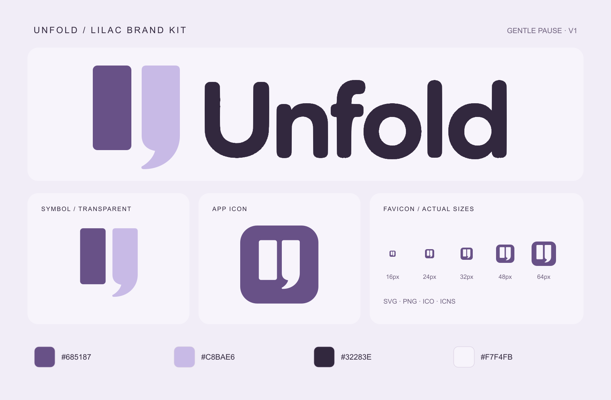

# Unfold · Lilac Brand Kit v1

2026-09-29. 처음 4번 시안의 라일락 테마를 배포용 로고에 적용했습니다.
왼쪽 막대의 네 모서리와 오른쪽 위쪽 모서리를 작게 둥글게 한 승인 형태, 아래 쉼표 곡선, 글자 윤곽과 배치를 유지했습니다.



## 주요 파일

- [투명 SVG 로고](svg/logo-lilac.svg)
- [투명 PNG 로고 1280px](png/logo/logo-lilac-1280.png)
- [심벌 SVG](svg/symbol-lilac.svg)
- [앱 아이콘 PNG 1024px](png/app-icon/unfold-1024.png)
- [파비콘 SVG](web/favicon.svg), [파비콘 ICO](web/favicon.ico)
- [Windows ICO](desktop/unfold.ico), [macOS ICNS](desktop/unfold.icns)
- [웹 연결 예시](web/head-snippet.html)

심벌·앱 아이콘은 16, 24, 32, 48, 64, 96, 128, 192, 256, 512, 1024px입니다.
가로 로고는 320, 640, 1280, 2560px 너비이며 투명 배경 기본형과 밝은 단색 버전이 있습니다.
웹용 Apple touch icon, Android chrome icon, maskable icon, site.webmanifest도 포함했습니다.

## 팔레트와 원본

- 라일락: `#685187`
- 연보라: `#C8BAE6`
- 글자: `#32283E`
- 밝은 배경·반전 심벌: `#F7F4FB`
- 미리보기 바탕: `#F1EDF7`

현재 `src/Unfold.Desktop/DesignSystem.Themes.cs`의 Plum 팔레트입니다.
기존 Oat 키트의 SVG 생성 원본에서 색상 토큰과 파일명을 변경한 후 PNG·아이콘 형식으로 출력했습니다.
기존 오트 키트는 별도 보존되어 있습니다. 이 폴더는 파일 패키지이며 앱·웹 연결 설정은 포함된 예시를 참고하세요.

## 검증과 재생성

크기·투명도·색상·SVG 구조·ICO 프레임·ICNS 디코딩·매니페스트를 검사했습니다.
[validation.json](validation.json), [assets.json](assets.json), [SHA256SUMS.txt](SHA256SUMS.txt)에 근거가 있습니다.
미리보기, 투명 로고, 실제 32px 파비콘을 시각 확인했습니다.
설치된 앱 아이콘, 브라우저 캐시·PWA 설치와 실제 배포는 미검증입니다.
ICNS는 Pillow로 인코딩·디코딩 확인했으며 iconset 원본도 있습니다.

재생성에는 Node.js의 sharp·pngjs와 Python의 Pillow가 필요합니다.

```sh
node scripts/build-brand.cjs
python3 scripts/package-brand.py
```

