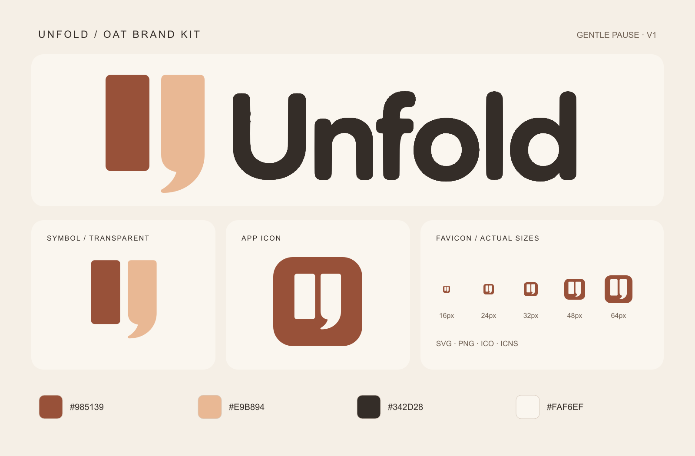

# Unfold · Oat Brand Kit v1

2026-09-28. 승인된 Gentle Pause 수정본을 Unfold의 현재 **다정한 오트** 팔레트로 제작했습니다.



## 바로 사용할 파일

| 용도 | 파일 |
|---|---|
| 기본 가로 로고, 투명 배경 | [svg/logo-oat.svg](svg/logo-oat.svg) |
| 어두운 배경용 가로 로고 | [svg/logo-cream.svg](svg/logo-cream.svg) |
| 두 색상 심벌, 투명 배경 | [svg/symbol-oat.svg](svg/symbol-oat.svg) |
| 어두운 단색 / 밝은 단색 심벌 | [svg/symbol-ink.svg](svg/symbol-ink.svg), [svg/symbol-cream.svg](svg/symbol-cream.svg) |
| 배경 있는 앱 아이콘 | [svg/app-icon-oat.svg](svg/app-icon-oat.svg) |
| 브라우저 파비콘 | [web/favicon.svg](web/favicon.svg), [web/favicon.ico](web/favicon.ico) |
| iPhone/iPad 홈 화면 아이콘 | [web/apple-touch-icon.png](web/apple-touch-icon.png), 180 × 180, 불투명 |
| 웹 앱 아이콘 | [web/android-chrome-192x192.png](web/android-chrome-192x192.png), [web/android-chrome-512x512.png](web/android-chrome-512x512.png) |
| 마스크 적용용 웹 앱 아이콘 | [web/maskable-icon-512x512.png](web/maskable-icon-512x512.png), 512 × 512, 불투명 |
| Windows 아이콘 | [desktop/unfold.ico](desktop/unfold.ico) |
| macOS 아이콘 | [desktop/unfold.icns](desktop/unfold.icns), 원본 크기 묶음은 [desktop/Unfold.iconset](desktop/Unfold.iconset/) |
| 웹 연결 예시 | [web/head-snippet.html](web/head-snippet.html), [web/site.webmanifest](web/site.webmanifest) |

## PNG 크기

- 심벌 및 앱 아이콘: **16, 24, 32, 48, 64, 96, 128, 192, 256, 512, 1024px** 정사각형.
- 가로 로고: **320, 640, 1280, 2560px 너비**. 높이는 비율에 맞춰 자동 계산했습니다. 기본 오트색과 밝은 단색 버전이 있습니다.
- 파비콘 PNG: **16, 24, 32, 48, 64, 128, 256px**.
- ICO에는 **16, 24, 32, 48, 64, 128, 256px** 이미지 7개가 들어 있습니다.

SVG는 크기 제한 없이 확대할 수 있는 실제 경로와 도형입니다. 래스터 이미지를 넣은 SVG가 아니며, Unfold 글자도 윤곽 경로여서 폰트 설치가 필요하지 않습니다.

## 모양과 색상

왼쪽 막대는 네 모서리의 라운딩을 줄였습니다. 오른쪽 막대는 위쪽 두 모서리만 작게 둥글게 하고 아래 쉼표 곡선을 유지했습니다. 작은 파비콘은 같은 도형을 조금 크게 배치했습니다.

| 역할 | 색상 |
|---|---|
| 왼쪽 심벌 / 아이콘 배경 | 테라코타 `#985139` |
| 오른쪽 심벌 | 살구빛 오트 `#E9B894` |
| 기본 글자 | 짙은 갈색 `#342D28` |
| 반전 심벌 / 밝은 배경 | 밝은 오트 `#FAF6EF` |
| 미리보기 바탕 | 오트 `#F5EFE6` |

기준: 현재 `src/Unfold.Desktop/DesignSystem.Themes.cs`의 OatLatte 색상. 밝은 배경에는 기본 로고, 어두운 배경에는 cream 버전을 사용하세요.

## 웹에 연결하기

1. 이 패키지의 `web/` 파일들을 서비스의 정적 파일 루트로 복사합니다. 현재 Unfold 저장소에서는 `web/`이 해당 위치입니다.
2. 페이지의 `<head>`에 `head-snippet.html`의 링크들을 넣습니다.
3. 헤더에서는 다음처럼 SVG를 사용합니다.

```html
<a href="/" aria-label="Unfold 홈">
  
</a>
```

하위 경로에서 서비스한다면 head-snippet의 절대 경로와 site.webmanifest의 start_url·scope를 배포 경로에 맞추세요. 매니페스트의 아이콘 경로는 매니페스트 파일 위치 기준입니다.

이 작업은 **파일 패키지 제작**입니다. 기존 서비스의 HTML, CSS, C# 앱 및 배포 설정에는 아직 연결하지 않았습니다.

## 제작·검증

- 내장 image_gen으로 오트색 시안을 만들고 [generation.md](generation.md)에 프롬프트를 보존했습니다.
- 배포용 심벌은 정밀 SVG 도형으로 정리했습니다. 글자는 승인된 수정본의 윤곽을 추출해 원래 모양을 유지했습니다. 승인본 이진 윤곽과 SVG 렌더의 IoU는 **0.9987**입니다.
- 모든 PNG는 같은 SVG에서 출력했습니다. 원본 사진을 크기마다 다시 생성하지 않았습니다.
- 크기, 알파 투명도, 실제 색상, SVG 구조, ICO 7개 이미지, ICNS 디코딩, 매니페스트 경로와 maskable 안전 영역을 검사했습니다.
- `preview.png`, 실제 32px 파비콘, 투명 640px 로고를 직접 확인했습니다.
- ICNS는 이 환경에서 iconutil 조립이 거부되어 Pillow 컨테이너 출력으로 대체했으며, 포함된 8개 표현을 모두 디코딩했습니다. iconset 원본도 포함했습니다.
- 설치된 앱의 Dock/작업 표시줄 표시, 브라우저 파비콘 캐시, PWA 설치와 실제 배포는 미검증입니다.
- 검사 결과: [validation.json](validation.json). 파일 목록·크기: [assets.json](assets.json). 무결성: [SHA256SUMS.txt](SHA256SUMS.txt).

## 재생성

Node.js의 `sharp`, `pngjs`와 Python의 Pillow가 필요합니다.

```sh
node scripts/build-brand.cjs
python3 scripts/package-brand.py
```

스크립트는 이 폴더 안의 산출물만 갱신합니다. `source/`는 승인된 시안과 생성 원본 기록이며, 서비스에서는 `svg/`, `png/`, `web/`, `desktop/`의 배포용 파일을 사용하세요.

