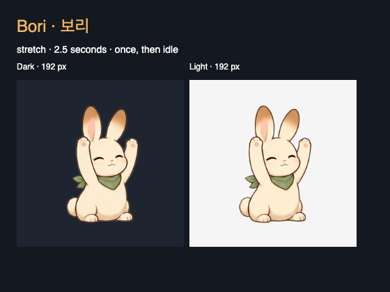

# 보리 — 펫 팩 후보 0.1.0

2026-09-14. 크림색 토끼, 캐러멜색 귀 끝, 작은 초록색 스카프를 가진 조용한 동료다.
Mochi의 색을 바꾸는 방식 대신 귀·표정·앞발 동작으로 휴식 상황을 구분한다.
현재는 로컬 설치와 품질 검수를 위한 후보이며 판매 승인된 상품은 아니다.



| 반응 | 동작 | 길이 |
|---|---|---|
| idle | 잠깐 눈을 감았다 뜨고 쉬는 대기 | 4초 반복 |
| attention | 귀를 세우고 고개를 살짝 기울이는 초대 | 1.125초 |
| stretch | 두 앞발을 들어 기지개를 켜고 내리기 | 2.5초 |
| celebrate | 가슴 앞에 앞발을 모으고 작은 미소 | 1.125초 |
| click | 한쪽 귀를 접고 고개를 기울이기 | 1초 |

모든 반응은 정확히 같은 idle 0번 프레임에서 시작하고 끝난다. 시간 배치는
`runtime/bori-rabbit/character.json`에서 조절하며 원본 PNG를 다시 그리거나 인코딩하지 않는다.

## 파일과 출처

- [원본 아틀라스](source/bori-atlas-v1.png): 1024×1536 RGBA PNG, 4열×6행, 셀당 256×256.
- [생성 기록·최종 프롬프트](generation.md): 내장 `image_gen` 사용. 외부 참조 이미지 없음.
- [제작 원장](resource.json): 내용 버전, 원본 SHA-256, 제작 방식과 미완료 상태.
- [실행 manifest](runtime/bori-rabbit/character.json): Unfold version 1 계약, 반응 5종.
- [픽셀 측정](quality/atlas-metrics.json): 투명도·가시 영역·발 위치. 원본 픽셀을 읽기만 한 결과.

원본과 실행 PNG의 SHA-256은 같다. 제작용 다층 `.aseprite`가 있는 것으로 기록하지 않는다.
원본 생성 기록은 제작 경로를 설명하며 상업적 권리 확인이나 독점 저작권을 보증하지 않는다.

## 팩 만들기와 사용

저장소 루트에서 Release 빌드 후 실행한다. 출력 파일은 새 경로를 사용한다.

```sh
dotnet src/Unfold.Desktop/bin/Release/net10.0/Unfold.dll \
  --pack-character Art/Characters/bori-rabbit/runtime/bori-rabbit 0.1.0 /tmp/Bori-0.1.0.unfoldpet
```

Settings → **Install pet pack…**에서 파일을 열고, 반응을 미리본 다음 **Install**을 누른다.
생성한 로컬 사본은 `artifacts/pet-packs/Bori-0.1.0.unfoldpet`에 있다.
원본·프롬프트·원장은 설치 팩에 포함되지 않으며, 보리를 기본 번들 목록에 추가하지 않았다.
설치할 때만 사용자 캐릭터 목록에 들어간다.

## 남은 품질 판단

- 가시 영역의 발 위치는 y=241–242다. 생성 프롬프트의 y=224·24px 여백 목표와는 다르다.
  현재 셀 경계에서 잘리는 가시 픽셀은 없지만 배치 목표를 완전히 충족했다고 보지 않는다.
- 셀 가장자리에 alpha 1/255인 미세한 잔여 픽셀이 있다. 가시 영역 판정에는 앱 클릭 기준과
  같은 alpha 26 이상을 사용했다. ‘모든 가장자리 값이 0’이라고 기록하지 않는다.
- 원본은 256px 셀이다. 우선 제작 기준인 384px보다 작으며 고DPI 최종 아트 승인은 남아 있다.
- 생성 프레임 사이의 선·귀·표정 변화가 자연스러운지 사람의 연속 재생 검수가 필요하다.
- 상업적 권리·판매 조건, 실제 구매 의사는 미확인이다. 결과물을 자동으로 판매 승인하지 않는다.

상세 결과는 [검증 기록](../../../docs/validation/2026-09-14-bori-candidate.md)을 따른다.
