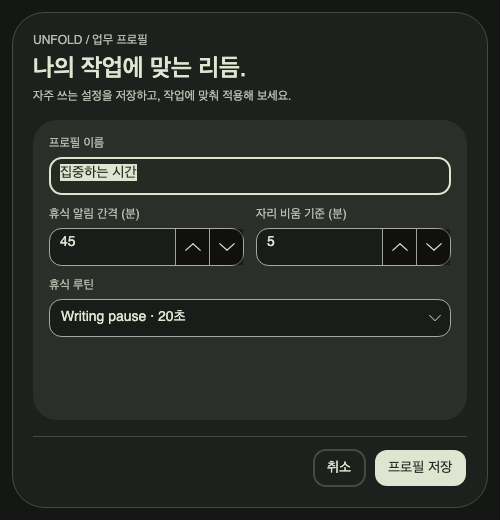
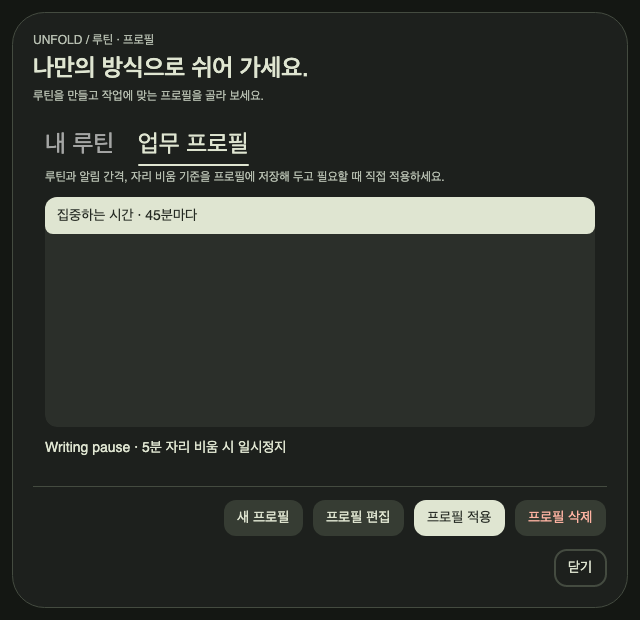

# 디자인 시스템 적용 검증

2026-09-14 · `release/mvp`, 기준 커밋 `d9ee699`와 기존 한글화·설정 대시보드 변경을
포함한 작업 트리. macOS 26.6.2 (25G83), arm64, .NET SDK 10.0.401 / 런타임 10.0.12,
Avalonia 12.1.2에서 확인했다.

## 적용 범위

[디자인 시스템](../design-system.md)의 공통 팔레트·버튼 상태·페이지 프레임을 설정,
루틴 편집, 업무 프로필 편집, 루틴·프로필 목록, 기록·CSV 내보내기, 펫 팩, 휴식 알림과
중첩 확인·이름 입력·오류 창에 적용했다. 저장·설치·내보내기 결과와 주요 동작은 하단에 고정한다.
타이머·데이터 저장·펫 파일 계약은 기존 동작을 유지한다.

## 자동 검사

- 전체 Release 테스트 **135개 통과**, 실패·건너뜀 0. 기존 130개에 디자인 시스템 검사 5개를 추가했다.
- 마지막 라이브러리 작업 버튼 배치 조정 후 영향받는 **13개 재검사 통과**, 실패·건너뜀 0.
- 기본·최소 창에서 하단 버튼 배치, 본문 스크롤 후 버튼 위치 유지, 두 라이브러리 탭의 작업 버튼 위치를 검사했다.
- 중첩 루틴 편집, 삭제 취소, 이름 입력 취소, 오류 확인을 실제 컨트롤 이벤트로 검사했다.
- 버튼 호버·누름·비활성·키보드 포커스, 선택 글자·목록·체크 표시의 대비를 검사했다.
- 주요 버튼의 글자 대비는 7:1 이상, 보조 설명과 카드의 대비는 4.5:1 이상을 수치로 검사했다.
- 루틴·프로필 검증 오류와 CSV 내보내기 실패 안내가 창 안에 남는지 검사했다.
- 펫 팩 최소 480×560에서 384px 미리보기 가로 넘침, 상태 표시와 설치 버튼 접근을 검사했다.

실행 명령:

```sh
dotnet test Unfold.slnx -c Release --no-restore -m:1 -p:UseSharedCompilation=false
dotnet test Tests/Unfold.Tests/Unfold.Tests.csproj -c Release --no-restore -m:1 \
  -p:UseSharedCompilation=false \
  --filter 'FullyQualifiedName~DesignSystemTests|FullyQualifiedName~PersonalizationWindowTests|FullyQualifiedName~SettingsDashboardTests'
```

[전체 테스트 로그](logs/2026-09-14-design-system/tests.log) ·
[최종 변경 영역 로그](logs/2026-09-14-design-system/focused-tests.log)

## macOS 게시 앱 진단

`osx-arm64` 자체 포함 Release 앱을 게시한 뒤 새 `UNFOLD_DATA_DIR`에서 `--smoke-test`를
실행했다. 최종 프로필은 `/tmp/unfold-design-HPqLGR/profile-ready`다.
진단은 종료 코드 0, `success: true`로 완료됐고 PNG 24장을 생성했다.
결과는 [진단 JSON](2026-09-14-design-system.json)과 아래 PNG로 보존한다.

확인 항목은 기본·최소 설정 창, 타이머 Reset·Stop 후 각각 1.2초 유지, 사용자 루틴 2개·프로필 1개 저장,
프로필 적용과 일시정지 유지, 진행 중인 휴식의 내용 보존, 명시적 완료 1회·CSV 1건,
펫 팩 설치·업데이트·재설치·잘못된 팩 거부, 중첩 대화상자 3종이다.
페이지 하단 버튼의 창 밖 넘침을 캡처 시 검사한다.

캡처에서 선택한 입력 글자·목록·체크 표시의 대비 부족을 발견해 공통 스타일을 수정했다.
기존 진단의 저장 직후 재열기가 비동기 라이브러리 갱신과 충돌한 문제는,
저장 콜백의 캐릭터 선택 갱신을 기다린 뒤 재열도록 수정했다.

## 화면

- [설정](images/2026-09-14-design-system/settings.png) · [최소 설정](images/2026-09-14-design-system/settings-minimum.png) · [스크롤 끝](images/2026-09-14-design-system/settings-minimum-scrolled.png)
- [내 루틴](images/2026-09-14-design-system/routine-editor.png) · [업무 프로필 편집](images/2026-09-14-design-system/profile-editor.png)
- [루틴 목록](images/2026-09-14-design-system/routine-library.png) · [프로필 목록](images/2026-09-14-design-system/work-profiles.png)
- [기록·내보내기](images/2026-09-14-design-system/weekly-review.png) · [휴식 알림](images/2026-09-14-design-system/reminder.png)
- [펫 팩](images/2026-09-14-design-system/pack-preview.png) · [잘못된 팩](images/2026-09-14-design-system/pack-error.png)
- [삭제 확인](images/2026-09-14-design-system/dialog-confirm.png) · [이름 입력](images/2026-09-14-design-system/dialog-prompt.png) · [오류](images/2026-09-14-design-system/dialog-error.png)





## 검증 한계

네이티브 캡처는 macOS 게시 앱의 off-screen 창을 렌더링한 결과다. 창이 실제 사용자 화면에서
마우스·키보드 입력을 받는 과정, IME·스크린리더, OS 파일 선택기·시스템 알림·로그인 동작,
Windows 및 실제 고DPI·다중 모니터 검증은 포함하지 않는다. 일부 영문 이름과 단순 도형 펫은
진단용 데이터이며 사용자 데이터를 번역하거나 아트를 교체한 것이 아니다.
세션 시간·파일 선택 경로·CSV 목적지·버튼 이벤트는 진단 코드에서 지정했다.
