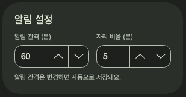

# 입력 필드 상태와 숫자 정렬 검증

2026-09-14 · `release/mvp`, 기준 커밋 `d9ee699` 위의 작업 트리. macOS 26.6.2 arm64,
.NET 10, Avalonia 12.1.2에서 확인했다.

`DesignSystem.cs`에서 텍스트·숫자·선택 입력의 호버와 포커스 배경·테두리 색 및 두께를
고정했다. 숫자 입력의 내부 텍스트칸은 투명하게 유지하고 값을 왼쪽·수직 중앙에 둔다.
Fluent 템플릿의 화살표는 가로로 나란히 배치된다. 오른쪽 끝의 아래 화살표 위·아래
모서리를 바깥 입력 테두리와 맞췄다. 화살표 호버 표면은 기본색으로 고정하고, 입력
포커스와 텍스트 선택은 유지한다.

실제 화면 피드백으로 추가 확인한 결과, 이전 검사는 템플릿 내부 `Border.Background`의
변화를 놓쳤다. 숫자·텍스트·선택 입력의 내부 배경은 호버 때 반투명 검정으로 바뀌었고,
숫자·텍스트 입력은 포커스 때 다른 어두운 색으로 바뀌었다. 이 배경을 각 입력의 기본색으로
고정했다. 숫자 입력의 `VerticalContentAlignment`도 `Stretch`에서 `Center`로 바꿨다.

- 전체 Release 테스트 **136개 통과**, 실패·건너뜀 0. [테스트 로그](logs/2026-09-14-input-fields/tests.log)
- Headless Avalonia에서 숫자·텍스트·선택 입력의 포커스와 포인터 이동 후 **내부 배경까지**
  유지되는지 확인했다. 숫자 텍스트의 수직 중앙 좌표, 가로 화살표 배치와 모서리도 검사했다.
- macOS Release 앱을 새 `UNFOLD_DATA_DIR`에서 실행한 진단은
  `success: true`로 끝났다. [진단 JSON](2026-09-14-input-fields.json)
- [설정 화면](images/2026-09-14-input-fields/settings.png)과 아래 확대 화면에서 숫자 값의 왼쪽·수직 중앙 배치와
  두 입력의 위·아래 오른쪽 모서리가 이어지는 것을 확인했다.

Headless 렌더링 비교: [기본](images/2026-09-14-input-fields/input-default.png) ·
[숫자 호버](images/2026-09-14-input-fields/input-hover-number.png) ·
[숫자 포커스](images/2026-09-14-input-fields/input-focus-number.png) ·
[텍스트 호버](images/2026-09-14-input-fields/input-hover-text.png) ·
[선택 호버](images/2026-09-14-input-fields/input-hover-choice.png).
기본 화면과 숫자 호버 화면의 PNG SHA-256은 동일하다.
포커스 화면에서 숫자 글자의 선택 강조는 유지되고, 배경과 바깥 테두리는 그대로다.

네이티브 화면은 off-screen 렌더링이며 호버·포커스 상태의 OS 실제 포인터 조작을
촬영한 것은 아니다. 상태별 외형 검사는 headless 입력 이벤트와 Avalonia 템플릿의
배경·경계 속성으로 확인했다.
