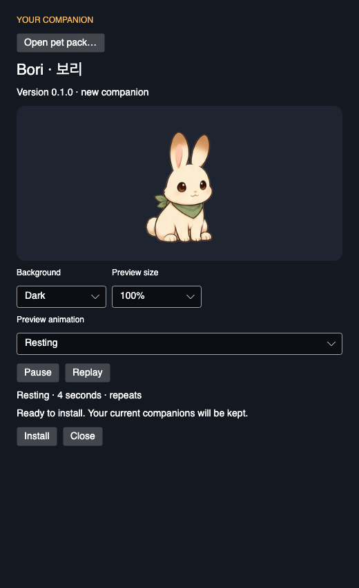

# 설치 전 펫 팩 미리보기 검증

2026-09-14 · `release/mvp`, 기준 커밋 `d9ee699`에 기존 보리 후보 작업과 이번 미리보기
변경을 적용한 작업 트리. C#/.NET 10, macOS arm64의 자체 포함 Release 게시 앱을 사용했다.
전체 결과는 [원본 JSON](2026-09-14-pet-pack-preview.json)에 보존했다.

## 변경한 동작

설치 전에 배경·크기를 비교하고 선택한 반응을 반복해서 볼 수 있도록
[PetPackWindow](../../src/Unfold.Desktop/PetPackWindow.cs)에 다음 조작을 추가했다.

- Dark / Light 배경과 100 / 150 / 200% 미리보기 크기. 각각 192 / 288 / 384 논리 픽셀이다.
- 현재 위치에서 Pause / Resume. 멈춘 상태에서 다른 반응을 선택해도 재생하지 않는다.
- 선택한 반응을 처음부터 시작하는 Replay. 반응 종료 후 기본 대기로 돌아가도 선택은 유지한다.
- 창이 숨겨진 동안 재생 중단. 다시 표시할 때 사용자가 선택한 Pause는 유지한다.
- 기본 반응의 읽기 쉬운 이름, 조작의 접근성 이름·툴팁, 로딩/실패 시 재생 버튼 비활성화.

새 클립을 읽기 전에 이전 재생을 멈춰, 이전 완료 이벤트가 새 선택을 덮어쓰지 않게 했다.
경고가 없으면 빈 안내 영역을 접어 큰 미리보기에서도 하단 버튼을 볼 수 있게 했다.
팩 설치·업데이트·재설치 계약, 보리 원본·실행 이미지와 팩 파일, 기본 Mochi 파일은 유지한다.

## 자동 검사

| 확인 | 결과 |
|---|---|
| 최종 Release 전체 테스트 | 122 통과, 실패·건너뜀 0 |
| 펫 팩 창 검사 | 기존 2개와 새 3개: 설치/업데이트/재설치, 취소, Pause/Replay, 크기·배경·배치, 숨김/재표시 |
| 일시정지 중 반응 전환 | 반응 길이를 넘겨 기다려도 완료되지 않음. Resume/Replay 후 1회 완료 및 기본 대기 복귀 |
| 크기·배치 | 480×560 최소 창에서 384px 미리보기 가로 넘침 없음. 520×850 기본 창에서 Install 버튼 전체 표시 |
| 저장 범위 | 미리보기 조작만으로 라이브러리에 설치되지 않음. 잘못된 팩 이후 재생/설치 버튼 비활성화 |
| macOS arm64 게시 | locked restore 후 자체 포함·ReadyToRun publish 성공 |
| 원본·팩·번들·의존성 | 보리 이미지/팩 SHA-256 유지. 기본 번들과 `packages.lock.json` 변경 없음 |

전체 테스트를 빌드와 함께 실행했고, 최종 배치 검사의 창 크기 변경 처리를 보완한 뒤
동일한 최종 테스트 바이너리를 `dotnet test Unfold.slnx -c Release --no-build --no-restore -m:1`로
실행해 122개 통과를 확인했다. 최초 제한 환경의 restore는 NuGet 취약성 정보 조회
`NU1900`으로 중단됐으나, 네트워크 접근이 허용된 환경에서 같은 locked restore가 통과했다.
검사를 끄거나 잠금 파일을 변경하지 않았다.

## 게시 앱 진단과 화면 확인

새 데이터 프로필로 실행했다:

```sh
UNFOLD_DATA_DIR=/private/tmp/unfold-preview.om9Q9Q/review-final \
  /private/tmp/unfold-preview.om9Q9Q/publish/Unfold --review-pet-pack \
  /Users/hwanghyeonseong/Documents/GitHub/Unfold/artifacts/pet-packs/Bori-0.1.0.unfoldpet
```

종료 코드 0, `success: true`. 2.5초 기지개를 선택하고 약 2.65초 동안 Pause를 유지했을 때
완료 이벤트가 발생하지 않았다. Replay 후 1회 완료와 기본 대기 복귀를 확인했고, 선택은
Stretch로 유지됐다. 설치 후 선택·타이머 Pause 유지, 디스크 재열기, 반응 5종의 실제 시간
기반 재생과 숨긴 펫의 상태 유지도 통과했다.



PNG 9장을 생성했다. 기본 미리보기와 큰 미리보기의 밝은/어두운 배경 캡처에서 토끼의
가시 영역, 조작 배치와 하단 버튼을 확인했다. 2배 캡처는 1040×1700이며 큰 펫 영역은
384 논리 픽셀이다. [밝은 배경](images/pet-pack-preview/pack-preview-large-light-2x.png) ·
[어두운 배경](images/pet-pack-preview/pack-preview-large-dark-2x.png)

**2배 렌더링과 실제 고DPI 화면 검증을 구분한다.** 이 실행의 `windowRenderScaling`은 1,
`captureScale`은 2다. off-screen 창을 큰 픽셀 버퍼에 렌더링한 결과이며, Retina 모니터나
Windows DPI 변경을 직접 검증한 결과는 아니다. 파일 선택 경로와 버튼 이벤트도 코드로
지정했다. 실제 OS 파일 선택 창·마우스·키보드·스크린 리더 조작은 미검증이다.

이 확대는 보리의 256px 원본을 바꾸지 않는다. 원본 고해상도 제작, 사람의 연속 재생
아트 검수와 상업적 권리 확인은 [보리 후보 검증](2026-09-14-bori-candidate.md)의 남은 항목이다.

로컬 전체 증거는 `artifacts/verification/pet-pack-preview-2026-09-14/`에 저장했다.
Git에서 제외되는 산출물이므로 핵심 JSON과 미리보기 PNG 3장은 이 문서 옆에도 보존했다.
