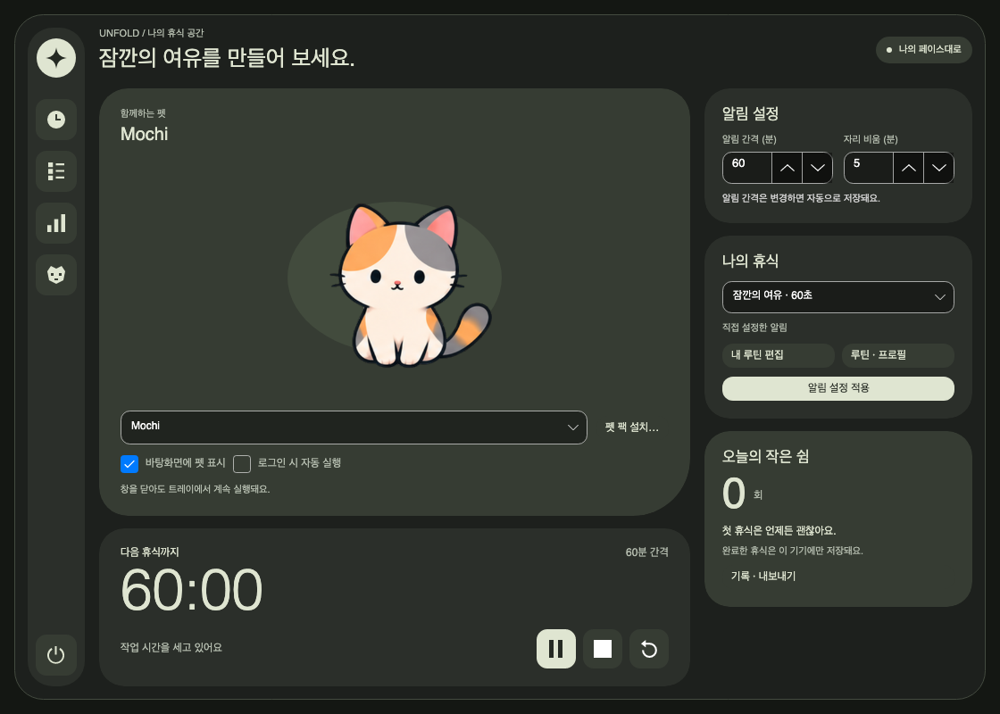

# 설정 대시보드 검증

2026-09-14 · `release/mvp`, 기준 커밋 `d9ee699` 이후 미커밋 작업 트리.
macOS 26.6.2 / arm64, .NET 런타임 10.0.12에서 확인했다.

## 구현

참고 이미지의 세로 아이콘 막대·큰 중심 카드·오른쪽 보조 카드·둥근 프레임을
Unfold 설정에 적용했다. 펫과 타이머는 가운데에 유지하고 오른쪽 설정 카드만 스크롤한다.
새 전역 테마나 저장 구조를 만들지 않았다. [구성 및 동작](../settings-ui.md)

`SettingsWindow.Layout.cs`에서 설정 창에 한정된 스타일과 화면을 구성한다.
기존 `SettingsWindow.cs`의 저장·실패 복원·캐릭터 선택·루틴 상태 동기화는 같은 경로를 사용한다.
왼쪽 바로가기는 기존 창을 열거나 타이머에 포커스를 옮기며, 종료 버튼은 기존 종료 처리를 호출한다.

## 자동 검사

```sh
dotnet test Unfold.slnx -c Release --no-restore -m:1 -p:UseSharedCompilation=false
dotnet restore Unfold.slnx --locked-mode -p:RuntimeIdentifier=osx-arm64 -m:1 -p:UseSharedCompilation=false
dotnet publish src/Unfold.Desktop/Unfold.Desktop.csproj -c Release -r osx-arm64 \
  --self-contained true --no-restore -p:PublishReadyToRun=true -p:UseSharedCompilation=false \
  -o /tmp/unfold-dashboard-chcGpB/publish
```

실행 시 `AVALONIA_TELEMETRY_OPTOUT=1`, `DOTNET_CLI_TELEMETRY_OPTOUT=1`을 설정했다.
전체 Release 테스트 **130개 통과, 실패 0, 건너뜀 0**. 빌드·고정 패키지 복원·macOS 게시가 통과했다.
처음 게시할 때 누락된 `osx-arm64` 복원 대상을 확인해 RID를 지정하여 복원했다.
패키지 버전이나 잠금 파일은 변경하지 않았다.

추가한 `SettingsDashboardTests` 3개는 다음 경계를 검사한다.

- 1120×800, 860×680, 1440×960에서 펫·타이머·로그인 옵션·종료 버튼이 창 안에 표시된다.
  카드끼리 겹치지 않고 오른쪽 카드에 가로 넘침이 없으며 마지막 동작까지 스크롤할 수 있다.
- 저장 전 자리 비움·루틴 선택을 유지한 채 창 크기를 바꿀 수 있다. 적용 버튼은 두 값을 실제 파일에 저장한다.
- Space 키로 왼쪽 루틴 바로가기를 열고 닫은 후, 타이머 바로가기로 조작 버튼에 포커스를 이동한다.
  한국어 접근성 이름과 도구 설명도 확인한다.

기존 타이머의 즉시 저장·초기화 후 일시정지·정지·키보드 조작, 펫 선택과 저장 실패 복원,
완료 기록·개인화·펫 팩 설치 및 미리보기 회귀 테스트도 통과했다.

## macOS 게시 앱 진단

```sh
UNFOLD_DATA_DIR=/tmp/unfold-dashboard-chcGpB/profile \
  /tmp/unfold-dashboard-chcGpB/publish/Unfold --smoke-test
```

새 빈 데이터 프로필을 사용했고 종료 코드 0,
[진단 JSON](2026-09-14-settings-dashboard.json)의 `success: true`를 확인했다.
PNG 21장, 루틴 2개, 프로필 1개, 완료 기록 및 내보내기 1건을 생성했다.
초기화·정지 대기, 휴식 창 취소, 펫 팩 설치·업데이트·재설치 복원도 통과했다.

`settingsLayout`은 실제 클라이언트 크기 860×680, 펫·타이머 버튼의 창 내부 배치,
오른쪽 카드 스크롤과 가로 넘침 없음이 확인된 결과다. 기본 크기와 최소 크기,
최소 크기에서 아래로 스크롤한 캡처의 한글·배치·카드 경계를 직접 확인했다.



[최소 크기](images/2026-09-14-settings-dashboard/settings-minimum.png) ·
[오른쪽 카드 스크롤](images/2026-09-14-settings-dashboard/settings-minimum-scrolled.png) ·
[초기화 후 대기](images/2026-09-14-settings-dashboard/timer-reset.png) ·
[정지](images/2026-09-14-settings-dashboard/timer-stopped.png) ·
[완료 기록 반영](images/2026-09-14-settings-dashboard/settings-completed.png)

## 검증 한계

네이티브 Avalonia 백엔드의 off-screen 진단이며 사람이 실제 모니터에서 조작한 녹화가 아니다.
기능 진단은 버튼 이벤트와 파일 선택 경로·세션 시간을 코드로 지정하며 OS 알림은 억제한다.
headless 키보드 입력은 실제 IME·스크린리더 검증을 대신하지 않는다.
Windows 실기, 다중 모니터·고DPI 변경, 실제 파일 선택 창과 로그인 동작은 이번 검증에 포함하지 않는다.
