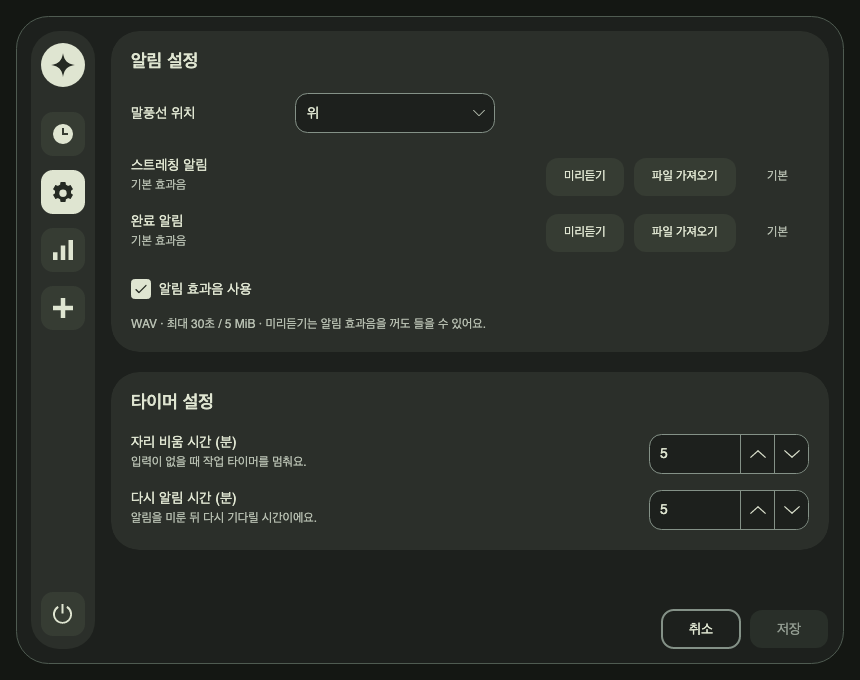
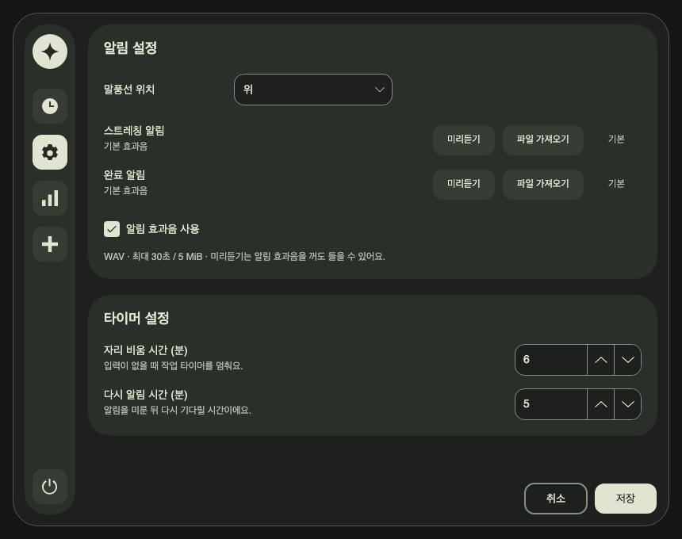

# 설정 탭 UI 개편 구현·검증

2026-09-18 · `release/mvp` · 기준 커밋 `5e91545aabefe3f89fee7cb5f8e20a55f17b92de` 위 작업 트리.

사용자가 승인한 [설정 탭 시안·계획](../plans/2026-09-18-settings-ui-redesign.md)의 SUI-01~07을 적용했다.
설정 화면의 크기·위계·배치를 정리하고 카드별 적용 버튼을 페이지 단위 취소·저장으로 통합했다.
이 보고서는 이번 설정 UI 변경만 다루며 기존 작업 트리의 다른 변경은 보존했다.

## 적용 결과

- 알림/타이머 카드 최대 폭 760px, 왼쪽 정렬, 카드 간격·패딩 20px를 적용했다.
  섹션 제목 18px, 항목명 14px, 파일명·도움말 12px로 위계를 나눴다.
- 말풍선 위치 드롭다운은 200×40px, 숫자 입력은 160×40px로 통일했다.
  효과음 두 행의 버튼 폭·시작선을 맞추고 긴 파일명은 말줄임과 툴팁으로 표시한다.
- 설정 드롭다운의 닫힌 표면·팝업·선택 항목에 별도 스타일을 적용했다.
  호버·포커스 때 입력 테두리를 덧칠하지 않으며 숫자의 왼쪽·수직 중앙 정렬을 유지한다.
- ‘알림 효과음 사용’ 체크박스를 완료 알림 행 아래로 옮겼다.
- 카드별 적용 버튼과 저장 유도 문구를 제거하고 본문 스크롤 밖 우측 하단에 취소·저장을 배치했다.
  홈의 시간 설정 카드와 적용 버튼은 기존 동작을 유지한다.

저장은 유효한 값이 마지막 저장 상태와 다를 때만 활성화된다. 값을 원래대로 되돌리거나 저장/취소하면
다시 비활성화된다. 알림과 타이머 설정은 기존 저장 경로로 한 번에 저장한다. 취소는 현재 탭을 유지하면서
마지막 저장값과 가져온 효과음 선택을 복원한다. 미리듣기만으로는 변경 상태가 되지 않는다.

저장 실패 시 실제 오류를 보여주고 초안을 보존하며 재시도할 수 있다. 잘못된 숫자 원문도 검사해
빈 값·문자·소수를 이전 정상값으로 잘못 저장하지 않는다. 저장/파일 가져오기 중에는 폼과 취소·저장을
잠시 비활성화한다. 파일 선택 취소는 변경으로 처리하지 않는다.

## 코드 경계

| 파일 | 이번 변경 |
|---|---|
| `SettingsWindow.Preferences.cs` | 두 섹션의 초안 비교, 유효성, 저장·취소, 오류 및 처리 중 상태, 공통 하단 버튼 |
| `SettingsWindow.Notifications.cs` | 알림 카드 배치, 드롭다운, 효과음 행·체크박스 위치, 가져오기/미리듣기 연결 |
| `SettingsWindow.Layout.cs`, `SettingsWindow.cs` | 설정 본문/하단 분리, 타이머 행, 런타임 변경 시 초안 보존 |
| `DesignSystem.cs` | 설정 전용 크기와 드롭다운 표면·팝업·항목 스타일 |
| `SmokeDiagnostics.cs` | 기본·최소 창, 변경 상태, 팝업 캡처와 하단 버튼 검증 |
| `SettingsPreferencesTests.cs` 및 기존 설정/타이머 회귀 검사 | 통합 저장·취소와 실패 복구, 파일/재생 상태, 레이아웃 검증 |

드롭다운 스타일은 현재 사용하는
[Avalonia 12.1.2 Fluent ComboBox 템플릿](https://raw.githubusercontent.com/AvaloniaUI/Avalonia/12.1.2/src/Avalonia.Themes.Fluent/Controls/ComboBox.xaml)의
실제 파트를 기준으로 한정했다. 다른 페이지 드롭다운에 이 설정 전용 스타일을 적용하지 않았다.

## 검증 결과

최종 코드 기준으로 새 `UNFOLD_DATA_DIR`을 사용했다. 원본 결과 경로와 카운터는
[검증 JSON](2026-09-18-settings-ui-redesign.json)에 보존했다.

| 검사 | 결과 |
|---|---|
| 기존 설정·타이머·디자인 관련 집중 검사 | 35/35 통과 |
| 새 설정 통합 회귀 검사 | 6/6 통과 |
| 전체 Release 테스트 및 빌드 | 202/202 통과, 실패·건너뜀 0, 종료 코드 0 |
| macOS 네이티브 off-screen 진단 | `success: true`, 종료 코드 0, 전체 화면 PNG 46장 생성 |
| 설정 전용 화면 확인 | 기본 1120×800, 최소 860×680, 수정 후 저장 활성, 드롭다운 팝업 4장 확인 |
| 배치·상태 진단 | 하단 버튼 고정, 가로 넘침 없음, 변경 시 저장 활성, 취소 복원 모두 통과 |
| `git diff --check` | 통과 |

새 회귀 검사는 저장값 복원과 탭 이동 중 초안 유지, 저장 실패 후 재시도, 잘못된 숫자 입력,
파일 선택 중 중복 동작 방지, 효과음 가져오기·기본 복원·취소, 미리듣기 종료, 긴 파일명과 팝업 스타일을 확인한다.
최소 창에서 일반 상태의 설정 본문은 세로 스크롤 없이 표시됐다. 높이가 부족한 상태에도 하단 버튼은
본문 스크롤 밖에 유지된다.

실행 명령:

```sh
UNFOLD_DATA_DIR=/tmp/unfold-settings-redesign.jynxCH/full-profile \
AVALONIA_TELEMETRY_OPTOUT=1 DOTNET_CLI_TELEMETRY_OPTOUT=1 \
/Users/hwanghyeonseong/.dotnet/dotnet test Unfold.slnx -c Release --no-restore --disable-build-servers \
  --logger trx --results-directory /tmp/unfold-settings-redesign.jynxCH/full

UNFOLD_DATA_DIR=/tmp/unfold-settings-redesign.jynxCH/smoke-profile \
AVALONIA_TELEMETRY_OPTOUT=1 DOTNET_CLI_TELEMETRY_OPTOUT=1 \
/Users/hwanghyeonseong/.dotnet/dotnet run --project src/Unfold.Desktop -c Release --no-build -- --smoke-test
```

재실행할 때는 위 데이터 경로를 새 임시 디렉터리로 바꾼다.

## 적용 화면

최소 창 — 변경 전 저장 비활성:



변경 후 — 저장 활성, 저장 유도 문구 없음:



[기본 창 화면](images/2026-09-18-settings-ui-redesign/settings-options-default.png) ·
[실제 드롭다운 팝업 캡처](images/2026-09-18-settings-ui-redesign/settings-direction-popup.png)

## 검증 한계

macOS 결과는 네이티브 Avalonia 렌더링과 프로그램으로 수행한 UI 이벤트 진단이다.
실제 마우스 조작, OS 파일 선택 창, 소리를 듣는 확인을 수행한 것으로 간주하지 않는다.
Windows 실기 화면·입력 동작은 미검증이다. 배포 파일을 새로 만들거나 게시하지 않았다.
일반적인 UX 후속 기능은 이번 작업에 포함하지 않았다.
