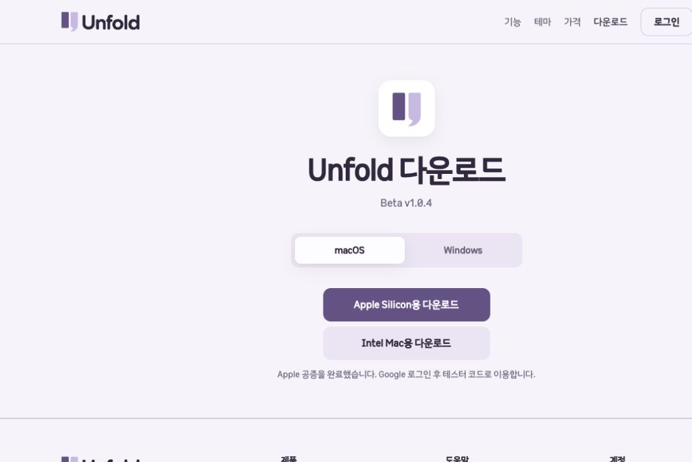

# Beta v1.0.4 배포 검증 — 2026-10-04

## 공개 결과

- [GitHub Release](https://github.com/C-Caffe1ne/Unfold/releases/tag/v1.0.4-beta): `1.0.4-beta`, prerelease, 2026-10-04 10:17:40 UTC 공개.
- [다운로드 웹사이트](https://unfoldpet.dokhustudio.com/#install): Mac Apple Silicon·Intel, Windows x64 설치 ZIP과 체크섬.
- 앱 소스/릴리스 대상: `8a42dafdf69465e0de225f81f4298d3a0406de6b`, `codex/beta-v1.0.4`.
- 기능 커밋 `ddedd01`, CI 화면 설정 `b13bb24`, Windows 진단 보정 `8a42daf`.
- 웹 배포 커밋: `dokhustudio/unfoldpet-web`의 `d4c8bfa` (`main`, Cloudflare Git 자동 배포).
- 전체 자산 10개의 GitHub 크기·SHA-256이 로컬 파일과 일치했다. [자산 목록](2026-10-04-beta-v1.0.4-release/assets.json).

## 포함 범위와 보존

GLB 가져오기·상황별 행동 지정·몸 방향 고정과 확대 렌더링 개선을 최신 Beta에 포함했다.
사용자 GLB 원본은 배포하지 않는다. 모든 업데이트 패키지에 GLB 파일이 없는지 검사했다.
기존 Supabase·브랜드 파일 22개는 해시가 유지되며 커밋에서 제외했다.
웹 로그인·회원가입 관련 기존 변경 8개는 유지하고, 겹치는 HTML/테스트 파일도 릴리스 변경만 부분 커밋했다.

## 자동 검사 및 실제 OS 진단

[최종 CI](https://github.com/C-Caffe1ne/Unfold/actions/runs/37194303126)는 두 플랫폼 모두 성공했다.

| 검사 | 결과 |
|---|---|
| macOS Release 테스트 | 605 통과, 0 실패, 0 건너뜀 |
| Windows Release 테스트 | 601 통과, 0 실패, 4 건너뜀 |
| 최종 공증 Mac ARM64 앱 smoke | 성공, 100개 캡처, updaterInstalled=true |
| 최종 공증 Intel 앱 smoke (Rosetta) | 성공, 100개 캡처, updaterInstalled=true |
| 실제 Windows CI 배포 앱 smoke | 성공, 종료 코드 0, 100개 캡처 |
| Windows 설치·재설치·제거 | 성공, 사용자 데이터 보존, 자동 시작 선택 보존·등록 정리 |
| 웹 배포 후보 | 69개 테스트, 정적 사이트 검사, 배포 dry-run 통과 |
| 로컬 HTTP 검사 | 106개 통과 |
| 공개 웹 검증 | 38개 통과 |

Windows에서 건너뛴 검사는 Mac 헤더 드래그 2개, 링크 파일 정리 1개, 변환 프로세스 취소 1개다.
패키지 설치·제거 검증은 일회용 Windows CI에서 실행했다. 사용자 PC의 수동 조작과 구분한다.

초기 Windows CI에서는 1024×768 화면에 1120×800 진단 창이 잘렸다.
일회용 CI 화면을 1920×1080으로 설정하고 실제 크기 검사를 유지했다.
진단에서 오래된 860×680 최소 크기를 강제하던 부분은 실제 설정 창 최소 크기인 640×560으로 복구했다.
확장 프레임이 최소 클라이언트 높이에 더해져 발생하던 차이를 없앴다.
또한 먼저 종료되는 안정 런처 대신 `current/Unfold.exe` 진단 프로세스의 종료를 기다리도록 했다.
이 변경을 포함한 최종 커밋으로 Windows와 Mac 설치본을 모두 다시 만들었다.

[검사 요약 JSON](2026-10-04-beta-v1.0.4-release/verification.json).

## 최종 Mac 공증

두 앱과 DMG가 모두 Accepted 상태이며 티켓을 붙였다. 패키지 래퍼는 DMG의 코드 서명·티켓·Gatekeeper를 검증한 후 ZIP을 생성했다.

| 대상 | Apple 제출 ID |
|---|---|
| ARM64 앱 | `d2cb6cc6-0a89-4b15-b17b-847ca385057a` |
| ARM64 DMG | `fa9b827f-3ea5-48c8-a2ee-316f102d3db8` |
| Intel 앱 | `fd0ee341-4ecd-40c0-b82e-948c907f2dc5` |
| Intel DMG | `3bb8638b-28c4-45d1-95ff-8b4cee7fa447` |

Windows 설치본은 코드 서명이 없다.

## 공개 앱 내 업데이트 검증

현재 `AppUpdates.cs`를 사용하는 별도 격리 실행기로 실제 Velopack 1.2.0 SDK와
공개 GitHub 소스를 연결했다. 사용자 설치본은 수정하지 않았다.
`osx-arm64-beta`, `osx-x64-beta`, `win-x64-beta` 세 채널에서 모두:

1. 설치 버전 `1.0.3-beta.1`에서 `1.0.4-beta` 발견.
2. 올바른 PackageId·채널의 Full 패키지 다운로드와 SDK 무결성 검사 통과.
3. 재생성한 업데이트 객체에서 Ready 상태 복원.
4. 설치 버전이 이미 `1.0.4-beta`이면 Current 상태이며 재다운로드를 제안하지 않음.

[공개 업데이트 결과](2026-10-04-beta-v1.0.4-release/public-updates.json).
재시작 후 사용자 설치 위치를 실제로 교체하는 단계는 이 검증에서 실행하지 않았다.
현재 로컬 `/Applications/Unfold.app`은 updater가 없는 `1.0.2-beta`이므로 최초 한 번 새 설치본을 직접 설치해야 한다.

## 공개 웹 및 파일 무결성

공개 `/`, `/install`, `/dashboard`, `/changelog`의 HTML 바이트가 배포 커밋과 일치했다.
SHA-256: `5fad94c586aac5bfdd10648da16a3f2cb5189a777a682fedb37031270cd9991a`.
이전 주소를 포함한 27개 다운로드 리디렉션의 목적지가 정확히 일치했다.
웹 다운로드 주소로 세 설치 ZIP과 체크섬을 실제 내려받고 크기·SHA-256 일치를 확인했다.
내부 문서·도구·없는 경로 3개는 HTTP 404였다.

브라우저에서 공개 Beta v1.0.4 표시, Mac 두 다운로드 버튼, Windows 탭,
GLB 변경 이력과 앱 내 업데이트 안내를 확인했다.
[공개 HTTP 결과](2026-10-04-beta-v1.0.4-release/public-web.json).

## 검증 경계

Mac Intel 실행은 Apple Silicon의 Rosetta 환경이다. 물리 Intel Mac, 실제 Retina 2× 디스플레이,
Windows 사용자의 SmartScreen 화면, 브라우저 다운로드부터 설치·로그인까지의 수동 흐름은 별도 확인 대상이다.
GLB 기능·확대 회귀 검증은 기존 [GLB 통합](2026-10-04-beta-glb-pets.md)과
[확대 화질 검증](2026-10-04-glb-resolution.md)에 기록했다.
