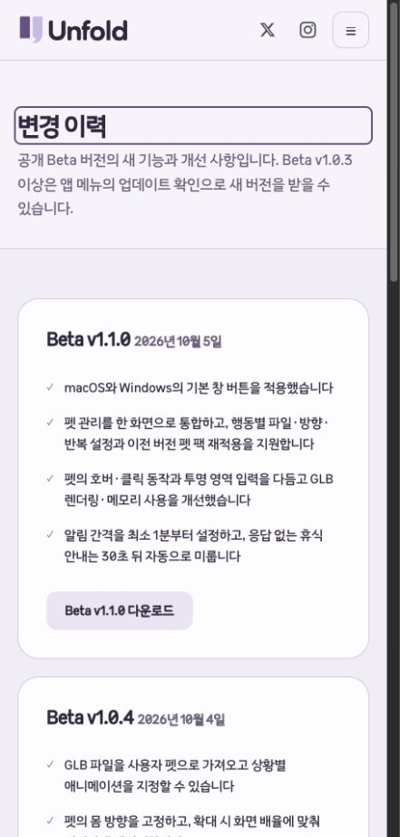
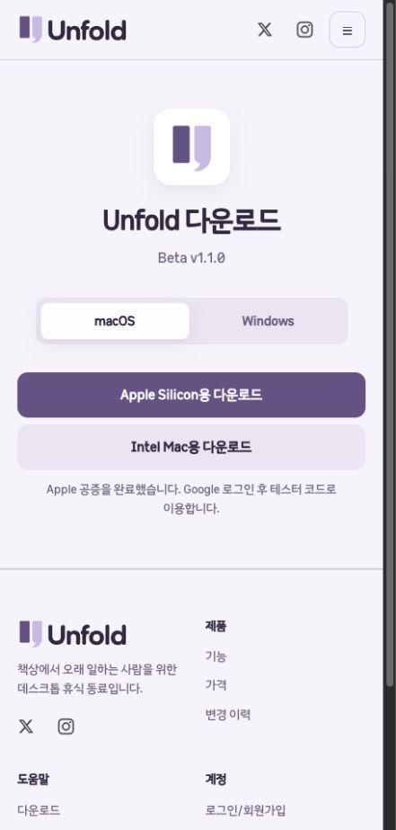

# Beta_v1.1.0 배포 검증 · 2026-10-05

## 기준과 공개 범위

- 마지막 공개 릴리스: `v1.0.4-beta`, 공개 소스 태그 `8a42dafdf69465e0de225f81f4298d3a0406de6b`.
- 이번 설치 파일의 실제 로컬 빌드 소스: `c86d650fb4e32fdea55d61d19d8d42143f174287` (`codex/beta-v1.1.0`, `1.1.0-beta`).
- 최신 개발본의 커밋된 펫·타이머 개선과 네이티브 창 변경 `8940a51`을 포함했다. 이전 `release/mvp`에서 빌드하지 않았다.
- 작업 위치: `/Users/hwanghyeonseong/.codex/worktrees/beta-v1-1-0/Unfold`.
- 사용자 지시에 따라 **앱 새 소스는 푸시하지 않았다**. GitHub에는 설치 ZIP 3개, SHA-256 파일 1개, 업데이트 피드 3개와 full nupkg 3개만 공개했다.
- 새 공개 태그 `v1.1.0-beta`는 기존 공개 커밋 `8a42daf…`를 가리킨다. GitHub 자동 생성 Source code ZIP·tar.gz는 새 바이너리의 소스가 아니며 릴리스 본문에도 안내했다.
- 공개 앱 브랜치 `codex/beta-v1.0.4`는 `717a63b…`로 유지됐다. 실제 빌드 소스와 공개 태그를 동일하다고 간주하지 않는다.
- 웹 커밋 `a66a6efa8f60c8dbede2ef77414442bbf8a400b0`는 별도 체크아웃에서 다운로드·변경 이력 관련 7개 파일만 커밋해 main에 fast-forward 푸시했다. 기존 웹 체크아웃의 병행 로그인 수정과 앱 체크아웃의 Supabase·브랜드 미커밋 변경을 보존했다.

## 실행 결과

| 검사 | 결과 |
|---|---|
| 전체 앱 Release 테스트 | 675/675 통과, 실패·건너뜀 0. `dotnet test Unfold.slnx -c Release -p:RestoreLockedMode=true` |
| 실제 배포 Apple Silicon 앱 | 새 `UNFOLD_DATA_DIR` 통합 진단 성공. 버전 `Beta v1.1.0`, updater 설치 확인, 자동 미루기 30.004781초 |
| 실제 배포 Intel 앱 | Rosetta로 격리 실행한 최종 통합 진단 성공, 자동 미루기 30.0188934초. 물리 Intel Mac 검증 아님 |
| Mac 코드 서명·공증 | 두 아키텍처 앱·DMG 모두 Developer ID 서명과 Apple 공증. `codesign --verify --deep --strict`, `stapler validate`, 앱 `syspolicy_check distribution`, DMG `spctl` 통과 |
| Windows 설치 파일 | `win-x64` self-contained ReadyToRun 교차 빌드, Velopack 1.2.0 설치 EXE·업데이트 패키지 생성. EXE 형식·ZIP CRC·피드 버전과 SHA-256 확인 |
| 공개 자산 | 10개 GitHub 자산의 서버 SHA-256과 바이트 수가 로컬과 모두 일치. 신규 소스 파일·개인 GLB·키 파일을 포함하지 않는지 패키지 목록 검사 |
| 앱 업데이트 | 로컬과 공개 GitHub 경로에서 3개 채널 모두 `1.0.4-beta → 1.1.0-beta` 조회·다운로드·체크섬·재시작 대기 복원·이미 최신 상태 확인 |
| 웹 자동 검사 | 테스트 71/71, 정적 검사 및 배포 dry-run 성공. 분리 체크아웃에서 로컬 HTTP 검사 110개 통과 |
| 웹 배포 | Cloudflare Workers Builds: unfoldpet-web 성공. 공개 HTML 4경로가 커밋과 일치 |
| 공개 웹 검사 | 42개 통과: HTML 4, 기존·신규 다운로드 리디렉션 31, 실제 설치 ZIP 3개와 체크섬 파일 다운로드·해시 4, 내부 경로 404 3 |
| 브라우저 | 공개 변경 이력의 7개 버전, 최신 다운로드 이동, macOS·Windows 탭과 각 OS 주소 확인. 456px 뷰포트에서 가로 넘침 없음 |

업데이트 검사는 실제 제품의 `AppUpdates.cs`와 Velopack SDK를 참조한 로컬 검사기로 수행했다. 조회·다운로드·대기 상태를 검증했으며 실제 설치 앱을 교체하는 Apply 동작은 실행하지 않았다.

## 발견된 실패와 한계

- Intel 앱 첫 통합 진단은 `Automatic snooze changed pause, duration, visibility or completion history`에서 실패했다. 당시 패키징과 검사가 함께 실행 중이었지만, 최초 보고서에 세부 값이 없어 부하를 원인으로 단정할 수 없다. 패키징 완료 후 **바이너리 변경 없이** 새 프로필로 재실행하여 통과했다. 최초 실패와 최종 결과를 함께 보존했고 원인은 미확정이다.
- 명령 초기 시도에서 `dotnet test --locked-mode` 옵션 오류가 발생해 지원되는 `-p:RestoreLockedMode=true`로 바꾸었다. 로컬 서버 실행의 샌드박스 바인딩 제한은 승인된 실행으로 해소했다. 제품 테스트 실패와 구별한다.
- Windows 코드 서명, 이번 버전의 Windows 실제 설치·재설치·제거·사용자 데이터 보존·실행·스냅·DPI 검증은 미수행이다. 이전 버전 CI 통과를 이번 버전 증거로 재사용하지 않았다.
- 네이티브 버튼의 실제 포인터 호버·닫기·최소화·드래그·전체 화면 검증 한계는 [네이티브 창 기록](2026-10-05-native-window-controls.md)에 있다. 통합 진단은 `nativeCaptionInputVerified=false`로 유지된다.
- 사람의 실제 입력과 제품 코드에서 창 상태를 요청한 자동 검사를 구별한다. Google 로그인·결제와 실제 사용자 데이터는 이번 진단에 사용하지 않았다.

## 공개 링크와 설치 파일

- [GitHub 릴리스](https://github.com/C-Caffe1ne/Unfold/releases/tag/v1.1.0-beta)
- [다운로드](https://unfoldpet.dokhustudio.com/install)
- [버전별 변경 이력](https://unfoldpet.dokhustudio.com/changelog)

웹에는 Beta v1.0.0, v1.0.1, v1.0.2, v1.0.3, v1.0.3 수정판, v1.0.4, v1.1.0의 핵심 패치만 기록했다. 이전 다운로드 주소 27개도 유지했다.

| 파일 | bytes | SHA-256 |
|---|---:|---|
| Unfold-v1.1.0-beta-osx-arm64-notarized-installer.zip | 77423991 | `c6a8662820e003f345a68eb3423ebe640780d77d0a113978d39411a2e5285dd7` |
| Unfold-v1.1.0-beta-osx-x64-notarized-installer.zip | 81588870 | `c7e5e564c55d9389138740b3245e64701fea15cb166569766b1c0386efd9d4d5` |
| Unfold-v1.1.0-beta-win-x64-installer.zip | 86675859 | `f528a895196ce4175cc8c1e5abc61403f4f9dedf71173ab23c2987703c82cc21` |

[원시 검증 자료](2026-10-05-beta-v1.1.0-release/result.json)에 로컬 소스·공개 태그·웹 커밋 구분과 검증 수치를 남겼다.

