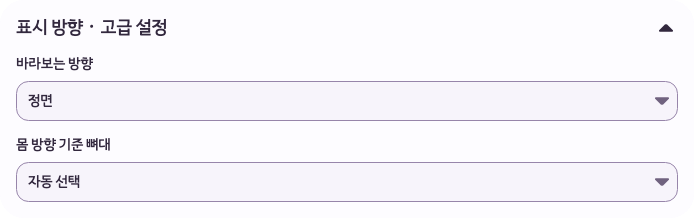

# GLB 고급 설정 스타일 수정 — 2026-10-05

이후 [행동별 설정 개편](2026-10-05-pet-action-editor.md)에서 사용자 요청에 따라 고급 설정 영역 자체를 제거했다. 아래는 제거 전 스타일 수정 기록이다.

## 원인

`GlbPetView`가 기본 `Expander`를 직접 생성하면서 앱 디자인을 연결하지 않았다.
Avalonia Fluent의 별도 헤더·본문 표면, 각진 경계선과 기본 방향 아이콘이 노출됐다.
수정 전 회귀 검사는 라일락 테마의 지정 표면색 `#FDFCFF` 대신 `#F2F2F2`를 관찰하며 실패했다.
기능 중심 검증에서 접힌 영역을 펼친 뒤 디자인 문서와 대조하는 검수가 누락됐다.
사용자가 제공한 화면은 이 누락을 보여준다.

## 기준과 변경

- 기준: `/Users/hwanghyeonseong/.codex/worktrees/6bca/Unfold`, `codex/beta-v1.0.4`, `253699e8f0acbde7f3ae6abe40025b73e6483ce4`, `1.0.4-beta`.
- [디자인 시스템](../design-system.md)의 Surface·Cream·Hover·FocusRing과 카드 모서리 24px, 안쪽 여백 16px을 적용했다.
- `Ui.Disclosure`는 `Ui.Card` 표면 안에 제목과 본문을 함께 배치하며 기존 `DirectionIcon`을 사용한다.
- 제목은 Section 18px·Semibold, 필드 사이 간격은 SettingsRowGap을 사용한다.
- 기존 Expander의 열림 상태·키보드 조작과 필드 값을 유지한다. 설명 문구나 신규 색상은 추가하지 않았다.
- 코드 소유 범위: `Ui.cs`, `Ui.Disclosure.cs`, `GlbPetView.cs`, `GlbDiagnostics.cs`, `GlbEditorUxTests.cs`.

## 검증

| 검사 | 결과 |
|---|---|
| 수정 전 회귀 검사 | 지정 표면색과 기본 회색의 차이로 실패: [로그](2026-10-05-glb-advanced-style/before-tests.log) |
| GLB 편집·펫 팩·디자인 시스템 테스트 | 32개 통과, 실패 0: [로그](2026-10-05-glb-advanced-style/focused.log) |
| Release 솔루션 빌드 | 경고 0, 오류 0: [로그](2026-10-05-glb-advanced-style/build.log) |
| macOS 네이티브 GLB 진단 | 새 격리 데이터로 Kazusa.glb 가져오기·저장·재생 및 네 테마 카드 검증 통과: [결과](2026-10-05-glb-advanced-style/result.json) |
| 시각 검수 | 네 테마 펼침, 라일락 접힘, 640×560 전체 화면에서 표면·모서리·아이콘·배치 확인 |
| 기존 변경 보존 | 작업 전 Supabase·브랜드 파일 22개의 SHA-256과 일치 |

자동 검사는 Space로 펼치기, 접은 뒤 방향 값 유지, 480×560 편집 창의 가로 넘침 여부도 확인한다.
네이티브 진단 캡처는 실제 macOS Avalonia 렌더링 결과이며, 설정 창은 화면 밖에 놓고 렌더링했다.
물리 마우스·키보드 입력, Windows 실기기 화면은 이번 작업에서 검증하지 않았다.
기존 실행 앱은 교체하지 않았으며 변경은 미커밋 상태다.

## 수정 화면

[접힌 상태](2026-10-05-glb-advanced-style/advanced-Plum-collapsed.png) ·
[오트 라테](2026-10-05-glb-advanced-style/advanced-OatLatte-expanded.png) ·
[세이지](2026-10-05-glb-advanced-style/advanced-Sage-expanded.png) ·
[미드나이트 블루](2026-10-05-glb-advanced-style/advanced-MidnightBlue-expanded.png) ·
[640×560 전체 화면](2026-10-05-glb-advanced-style/settings-advanced-640-560.png)
