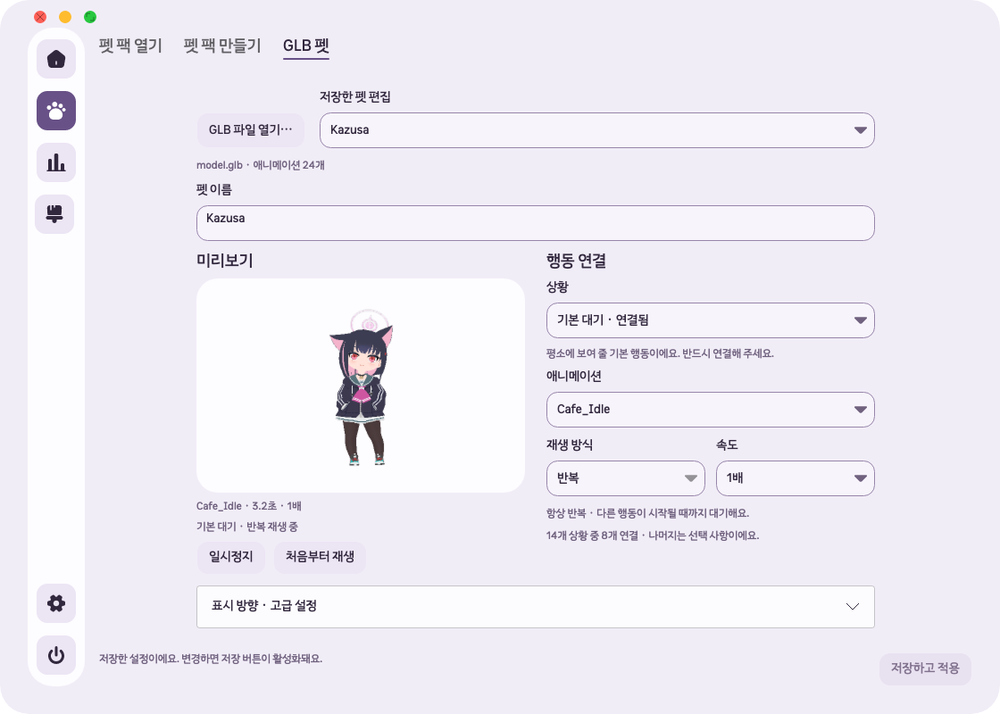

# GLB 편집 UI/UX 개선 — 2026-10-05

`codex/beta-v1.0.4`, HEAD `717a63b`, `1.0.4-beta`와 직전 GLB 메모리 최적화를 포함한 작업본에서 감사·수정했다. 이전 `release/mvp` 소스와 설치 앱은 사용하지 않았다. 이번 변경은 개발 소스이며 공개 설치 파일에는 아직 포함하지 않았다.

## 발견한 문제와 수정

| 문제 | 사용자 영향 | 수정·완료 기준 |
|---|---|---|
| 큰 미리보기 아래 14개 설정 행이 길게 이어짐 | 수정하는 행동과 미리보기를 동시에 보기 어려움 | 상황 선택 후 해당 행동의 설정만 표시. 넓은 창은 좌우 배치, 좁은 창은 작은 미리보기와 세로 배치 |
| 반복·속도 열에 눈에 보이는 제목과 고정 이유가 부족함 | 왜 변경이 안 되는지, 반복이 언제 끝나는지 불분명 | 애니메이션·재생 방식·속도 레이블과 상황별 설명. 다섯 고정 재생 규칙을 Core와 UI에서 공유 |
| 연결하지 않은 행동의 반복·속도를 변경할 수 있음 | 효과 없는 설정을 저장했다고 오해 | ‘연결 안 함’으로 명명하고 관련 설정 비활성화. 기본 대기 대체 미리보기 명시 |
| 한 번 재생을 마치면 자동으로 기본 대기를 재생함 | 선택된 이름과 실제 화면이 달라지고 반복 여부를 판단하기 어려움 | 마지막 자세와 ‘한 번 재생 완료’를 유지. 실제 펫 복귀와 미리보기 정지의 차이를 설명 |
| 일시정지 뒤 다시 재생해도 계속 정지함 | 버튼 이름과 행동 불일치 | ‘처음부터 재생’은 정지를 해제하고 처음부터 시작. 현재 위치에서 계속 재생하는 버튼과 구분 |
| 저장한 펫을 열기만 해도 변경 상태가 됨 | 불필요한 저장·폐기 확인 | 프로그램이 이름을 채우는 이벤트와 사용자 변경 구분. 깨끗한 상태·빈 이름·저장 완료 후 저장 비활성화 |
| 미리보기 준비 중 저장하면 이전 이미지가 남을 수 있음 | 선택 행동·속도와 화면 불일치 | 저장으로 무효화한 비동기 미리보기를 선택한 행동으로 복구 |
| 처음부터 루트 뼈대·메시 수 등 전문 정보 노출 | 기본 설정에 필요한 정보가 묻힘 | 방향·뼈대·모델 상세를 접을 수 있는 고급 설정으로 이동 |

파일 가져오기·저장 데이터·실제 펫의 이벤트 흐름은 유지한다. GLB의 재생 방식은 기존과 같이 한 번/반복이며 지원하지 않는 핑퐁 옵션은 추가하지 않았다. 펫 이름은 행동 설정 위에 놓고 한국어 레이블과 긴 이름의 말줄임·툴팁을 유지한다.

## 공식 편집기에서 확인한 방식

[Unity Animation 탭](https://docs.unity3d.com/6000.0/Documentation/Manual/class-AnimationClip.html)은 클립 선택, 선택 클립의 반복 설정, 미리보기의 재생·일시정지·속도·상태를 구분한다. 이를 Unfold의 상황 선택 → 애니메이션·재생 설정 → 미리보기 구조에 적용했다.

[Godot 애니메이션 편집 안내](https://docs.godotengine.org/en/stable/tutorials/animation/introduction.html#run-the-animation)는 처음부터 재생하는 명시적 조작과 반복 설정을 제공한다. Unfold에서도 처음부터 재생과 일시정지/계속 재생을 분리했다. 두 제품은 설계 참고 사례이며 Unfold에 게임 엔진의 타임라인·키프레임 편집을 추가한 것은 아니다.

## 화면

[변경 전: 넓은 창](2026-10-05-glb-editor-ux/before-wide.png) · [변경 전: 최소 창의 긴 행동 목록](2026-10-05-glb-editor-ux/before-small-mappings.png)

[중간 창에서 클릭 설정](2026-10-05-glb-editor-ux/after-medium-click.png) · [최소 창에서 드래그 반복 설정](2026-10-05-glb-editor-ux/after-small-held.png) · [최소 창의 고급 설정](2026-10-05-glb-editor-ux/after-small-advanced.png) · [가져오기 전 안내](2026-10-05-glb-editor-ux/after-empty.png)

## 검증

[검증 JSON](2026-10-05-glb-editor-ux/verification.json) · [전체 검사 로그](2026-10-05-glb-editor-ux/tests-full.log) · [집중 검사 로그](2026-10-05-glb-editor-ux/tests-focused.log) · [네이티브 결과](2026-10-05-glb-editor-ux/native-result.json)

- GLB 집중 검사 **29개 통과**.
- 최종 `dotnet test Unfold.slnx -c Release --no-restore`: **621개 통과, 실패·건너뜀 0개**.
- macOS 네이티브 GLB 진단 **성공**, 최종 화면 30개 캡처. 모델 가져오기·저장·재열기·상황별 재생·해상도·숨김 흐름 확인.
- `git diff --check` 통과. 직전 메모리 렌더러와 관련 없는 기존 22개 파일의 해시 보존 확인.

 변경 전 새 UX 검사 3개가 모두 실패했고, 수정 후 저장 상태·미지정 설정·한 번 재생·다시 재생 회귀를 통과했다. 추가 검사는 다섯 고정 반복 규칙, 두 창 크기의 가로 넘침·선택 행동 표시, 저장 중 미리보기 경쟁 상태를 다룬다.

실제 Kazusa GLB를 새 `UNFOLD_DATA_DIR`로 가져와 macOS 네이티브 앱의 설정 1120×800·860×680·640×560, 단독 편집 620×850·860×680·480×560 화면을 캡처했다. 한 차례 중간 높이에서 재생 버튼이 아래로 밀리는 문제를 확인해 미리보기 높이를 보완했다. 짧은 창에서는 세로 스크롤을 사용하며 가로 넘침을 검사한다.

네이티브 진단은 대부분 화면 밖 창의 렌더 캡처이며 해상도 확인 창만 실제 화면에 배치한다. 물리 마우스·화면 읽기 프로그램·Windows 실기 조작을 검증했다는 뜻이 아니다. Windows UI 실기와 공개 배포는 미검증이다. 자동 검사의 포인터 이벤트·들기·착지 검증은 실제 하드웨어 조작과 구분한다.

## 변경 파일과 보존 범위

- `GlbPetView.cs`: 이 탭의 구성·반응형·미리보기·저장 상태. 다른 페이지의 공용 버튼 동작은 수정하지 않음.
- `GlbPetDraft.cs`: 기존 강제 반복 규칙을 UI가 참조하도록 추출. 저장된 매핑과 원본 GLB 보존.
- `GlbDiagnostics.cs`, `GlbTests.cs`, `GlbEditorUxTests.cs`: 상태 검증 및 크기별 진단.
- `docs/glb-pets.md`, 문서 목록과 이 기록: 실제 사용법·검증 근거.

직전 메모리 최적화와 기존 Supabase·브랜드 변경은 보존했다. 웹사이트, 릴리스 태그, 업데이트 피드는 변경하지 않았다.
