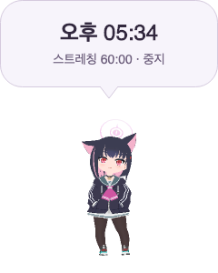

# 호버 진입·해제의 펫 창 안정화 — 2026-10-05

## 원인

사용자는 macOS와 Windows에서 마우스를 올리거나 뗄 때 캐릭터가 순간적으로 튄다고 보고했다.
기존 `RefreshSpeech`는 호버하지 않을 때 펫 창을 192×192로 줄이고, 호버 시에는
위·아래 말풍선에서 240×300, 좌·우 말풍선에서 444×192로 늘렸다.

[9월 27일 수정](2026-09-27-hover-jump.md)은 창 이동 전에 Canvas 배치를 확정해
최종 펫 원점과 위치 변경 이벤트의 원점을 맞췄다. 그러나 네이티브 창 크기와 렌더링 표면은
여전히 매번 바뀌었다. 창 크기 변경과 화면 합성이 한 번에 처리된다는 보장이 없어
최종 좌표가 같아도 중간에 어긋난 프레임이 보일 수 있는 경로가 남아 있었다.
이번 수정은 호버 전환에서 그 크기·좌표 변경 자체를 제거한다.

작업 기준은 `/Users/hwanghyeonseong/.codex/worktrees/6bca/Unfold`의
`codex/beta-v1.0.4`, HEAD `253699e8f0acbde7f3ae6abe40025b73e6483ce4`, 버전 `1.0.4-beta`다.
다른 worktree의 브랜치·HEAD·변경·버전을 비교했고, 직전 행동 편집기 미커밋 수정 위에서 작업했다.

## 변경

- 알림이 없을 때는 호버 말풍선 공간을 미리 확보한다. 마우스 진입·해제에는 내용과 꼬리의 표시만 바꾼다.
- 레이아웃이 같으면 창 크기·위치와 펫의 Canvas 원점을 다시 쓰지 않는다.
- 화면 가장자리에 펫을 놓을 때는 두 플랫폼 모두 펫 영역을 기준으로 제한한다. 확보된 투명 공간 때문에 Windows 펫이 가장자리에서 밀리지 않게 했다.
- 숨겨진 공간과 정보용 호버 말풍선의 클릭 통과, 기존 클릭·드래그·행동 지정·알림 우선순위를 유지한다.
- GLB 애니메이션 전환이나 사용자 지정 클립을 바꾸지 않았으며, 제품 UI에 설명 문구를 추가하지 않았다.

## 소유 파일

- `src/Unfold.Desktop/PetWindow.cs`: 공간 예약, 표시와 배치 변경 분리, 화면 가장자리 제한.
- `Tests/Unfold.Tests/PetHoverTests.cs`: 네 방향 반복 진입·해제에서 크기·위치 이벤트 0회, 펫 원점과 클릭 통과 검사.
- `Tests/Unfold.Tests/OriginalCompanionTests.cs`: 입력 좌표를 실제 펫 위치에서 변환하고, 불투명 픽셀에 입력되는지 확인.
- `Tests/Unfold.Tests/BreakReminderTests.cs`: 알림 미리보기 종료 시 예약 공간을 포함한 원래 크기·펫 원점 복귀와 숨김 확인.
- 이 검증 기록·근거 파일, `docs/README.md`, `docs/verification.md`.

작업 전 미커밋 파일 69개의 SHA-256을 비교했다. 이번 검증 링크를 추가한 문서 인덱스 둘을 제외하고
직전 행동 편집기·Supabase·브랜드 등 기존 변경은 그대로 보존했다.

## 검증

| 검사 | 결과 |
|---|---|
| 수정 전 회귀 재현 | 새 호버 검사 네 방향 모두 실패: [로그](2026-10-05-hover-surface-stability/before-tests.log) |
| 집중 검사 | 호버·클릭 통과·가장자리·GLB·커스텀 및 기본 펫 110개 통과: [로그](2026-10-05-hover-surface-stability/focused.log) |
| 알림 회귀 | 미리보기·휴식 알림 10개 통과: [로그](2026-10-05-hover-surface-stability/reminder.log) |
| 최종 전체 Release 검사 | 670개 통과, 실패·건너뜀 0: [로그](2026-10-05-hover-surface-stability/full-final.log) |
| Release 솔루션 빌드 | 경고 0, 오류 0: [로그](2026-10-05-hover-surface-stability/build.log) |
| macOS 통합 진단 | `success: true`, 알림·타이머·설정·펫 팩·클릭 및 방향 회귀 확인: [결과](2026-10-05-hover-surface-stability/smoke.json) |
| 패치 검사 | `git diff --check` 통과 |

초기 전체 검사에서 669개가 통과하고 미리보기 종료 후 크기를 항상 192×192로 가정한 검사 1개가 실패했다.
종료 후 초기 크기·펫 원점 복귀와 말풍선 숨김을 검사하도록 갱신한 뒤 전체 검사를 다시 통과했다.
원래 펫 위치가 창 원점이라는 가정도 제거해 클릭·누름 유지 검사가 실제 펫에 입력되도록 했다.

### macOS 네이티브 전후 측정

별도 격리 프로필에서 실제 네이티브 펫 창을 열고 2D 불투명 픽셀 fixture와 `Kazusa.glb`를 확인했다.
각 펫의 네 방향에 대해 진입·해제를 4회씩 반복했다. 총 64번의 전환이다.
클립 변화와 창 변화를 구분하기 위해 펫 재생을 멈추고 GLB 호버 행동 연결을 비웠다.
앱의 호버 처리 함수를 호출하고, 크기·위치 이벤트와 AppKit `NSWindow.frame`, 펫 원점을 읽었다.

| 측정 | 수정 전 | 수정 후 |
|---|---:|---:|
| 창 크기 변경 이벤트 | 64 | 0 |
| 창 위치 변경 이벤트 | 48 | 0 |
| 초기 값과 다른 네이티브 창 frame 표본 | 32 | 0 |
| 최종 펫 원점 변경 | 0 | 0 |

[수정 전 원본](2026-10-05-hover-surface-stability/native-before.json) ·
[수정 후 원본](2026-10-05-hover-surface-stability/native-after.json) ·
[측정 소스](2026-10-05-hover-surface-stability/NativeHoverProbe.cs) ·
[측정 프로젝트](2026-10-05-hover-surface-stability/NativeHoverProbe.csproj)

최종 측정에서는 초기화 후 `DiagnosticMode`를 끄고 진단용 최소 크기를 0으로 풀었다.
위·아래 창은 240×300, 좌·우 창은 444×192로 고정됐다. 폴링 타이머를 중지하고 창을 클릭 통과로 두어
사용자의 실제 포인터와 충돌하지 않게 했다. 측정 코드는 현재 체크아웃과 로컬 Kazusa 경로를 참조하므로
다른 컴퓨터에서 재현할 때는 경로를 변경하고 새 빈 `UNFOLD_DATA_DIR`을 지정해야 한다.

## 미검증·위험

Windows 실제 창과 물리 마우스 입력은 이번 작업에서 검증하지 않았다.
macOS에서는 실제 창을 측정했지만 호버 호출은 자동 조작이며 모든 화면 합성 중간 프레임을 촬영한 검사는 아니다.
사용자가 서로 다른 자세의 행동을 연결했을 때 생기는 클립 간 자세 변화는 이번 수정 대상과 별개다.

호버하지 않을 때도 작은 투명 말풍선 영역이 창에 포함되므로 이전보다 네이티브 표면이 커진다.
GLB 렌더링 해상도와 버퍼 크기를 늘리지는 않았다. 장시간 메모리 측정은 수행하지 않았다.
사용자 데이터와 실행 중인 일반 앱은 교체하지 않았으며 변경은 미커밋·미배포 상태다.

## 렌더링 확인

[2D 오른쪽 호버 말풍선](2026-10-05-hover-surface-stability/sprite-right.png)
