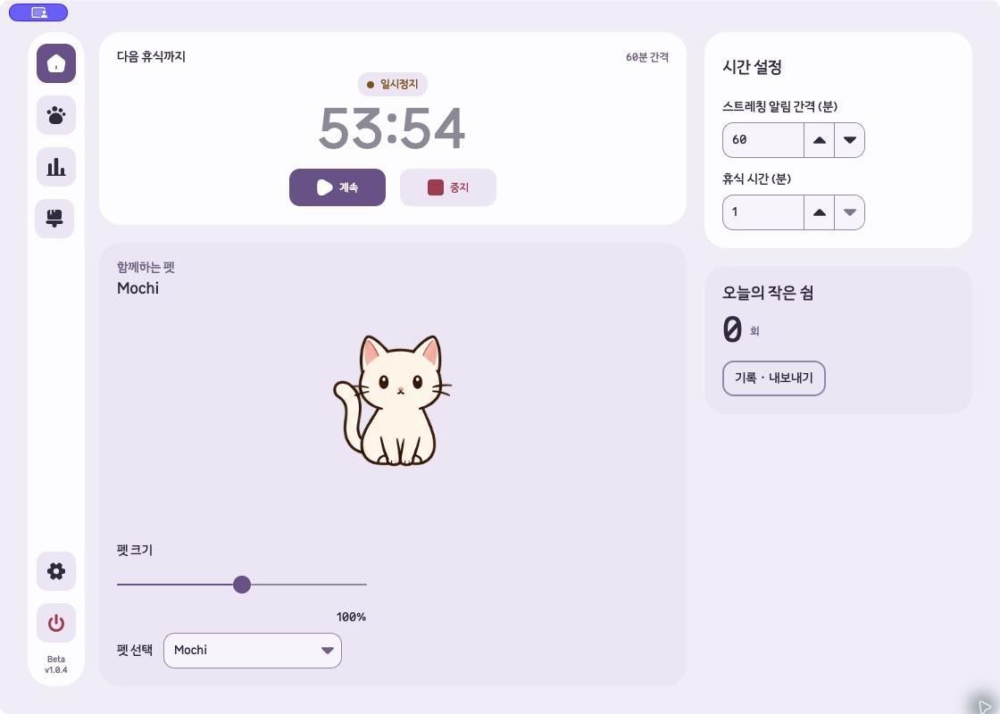
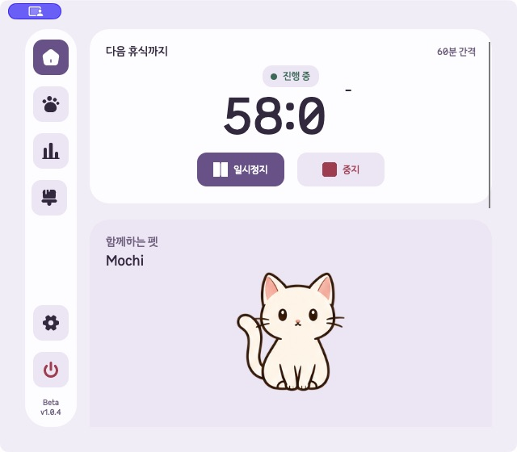
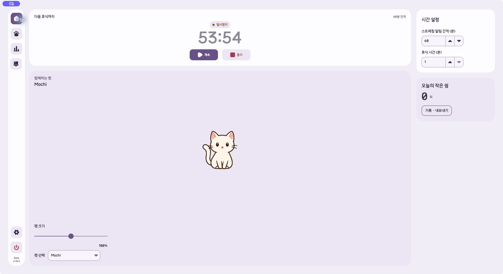

# OS 네이티브 창 버튼 구현 · 2026-10-05

## 원인

메인 창은 `BorderOnly`, 투명 클라이언트 영역, 앱에서 그린 신호등과 포인터 좌표 기반 드래그를 사용했다. 버튼 간격·아이콘·호버는 AppKit 또는 Windows가 관리하는 값이 아니었다.

기준은 `/Users/hwanghyeonseong/.codex/worktrees/6bca/Unfold`, `codex/beta-v1.0.4`, HEAD `5d09db9010792ba2c2c8b6440470a43506dc3cff`, 프로젝트 버전 `1.0.4-beta`다. 이전 `release/mvp` 체크아웃이나 설치 앱을 수정하지 않았다.

## 변경

- 메인 창을 `WindowDecorations.Full`로 변경했다. macOS만 클라이언트 영역을 확장해 AppKit 표준 닫기·최소화·전체 화면 버튼을 사용한다. 제목표시줄 높이는 시스템 기본값 `-1`이다.
- Windows는 확장을 끄고 OS 기본 제목표시줄과 캡션 버튼을 사용한다. Avalonia 12.1.2의 Windows 확장 모드는 Avalonia가 그리는 버튼 경로여서 사용하지 않는다.
- 커스텀 버튼·아이콘·호버·직접 좌표 드래그와 `EndWindowMove()` 상태를 제거했다.
- macOS 확장 영역에는 `TitleBar` 입력 역할을 지정한다. 이동은 Avalonia 네이티브 백엔드가 AppKit `performWindowDragWithEvent`로 요청한다. 앱에서 창 좌표를 갱신하지 않는다.
- 콘텐츠는 실제 `WindowDecorationMargin`에 맞춰 배치한다. 이 macOS 환경의 상단 여백은 28, 카드 시작은 36이었다. Windows 비확장 모드에서는 제목표시줄 높이를 본문에 다시 더하지 않는다.
- 앱 배경을 클라이언트 영역 끝까지 채우며 바깥 모서리는 OS가 관리한다. 기존 내부 카드와 테마를 유지한다.
- 기존 `Closing → HideToTray` 경로를 유지했다. 닫기 요청 후 같은 창을 재사용하며 타이머 중지·일시정지 상태가 바뀌지 않는지 검사한다.
- 자동 진단은 실제 버튼 클릭과 프로그램에서 요청한 창 상태 전환을 구별한다. `nativeCaptionInputVerified=false`는 의도적으로 유지한다.

## 소유 파일

- `src/Unfold.Desktop/SettingsWindow.cs`
- `src/Unfold.Desktop/SettingsWindow.Chrome.cs`
- `src/Unfold.Desktop/SettingsWindow.Layout.cs`
- `src/Unfold.Desktop/SmokeDiagnostics.cs`
- `Tests/Unfold.Tests/WindowControlTests.cs`
- `Tests/Unfold.Tests/ThemeTests.cs` — 기존 투명 배경 전제를 네이티브 불투명 배경 계약으로 변경

다른 기능, 펫·계정 창, 패키지 버전, 설치·배포 설정은 변경하지 않았다. 작업 전 변경 파일의 해시를 대조했으며 소유 파일 밖의 기존 변경은 모두 보존됐다.

## 검증

| 검사 | 결과와 범위 |
|---|---|
| 변경 전 관련 검사 | 29/29 통과 |
| 최종 창 제어·테마·대시보드·반응형 집중 검사 | 25/25 통과. 커스텀 글리프 검사를 네이티브 구성·창 수명주기·여백 검사로 대체 |
| 최종 전체 Release 검사 | 674/674 통과, 건너뜀 0 |
| 실제 macOS 백엔드 통합 진단 | 성공, 약 56.2초. 새 `UNFOLD_DATA_DIR`; 최소화·확대·복원 상태 요청, 닫기·재열기, 타이머 보존, 프레임 불투명도, 제목표시줄 입력 역할, 4개 테마와 최소 크기 검증 |
| Windows 게시 빌드 | `win-x64`, framework-dependent Release 생성 성공. Windows 실행 증거는 아님 |
| macOS 실제 UI | AppKit `close button`, `full screen button`, `minimize button` 접근성 항목 확인. 별도의 앱 버튼 없음 |
| 시스템 확대·복원 | 실제 시스템 버튼의 접근성 `zoom the window` 동작으로 1120×800 → 1920×1050 → 1120×800 확인. 타이머 일시정지 및 펫 표시 유지 |
| 실제 기본·최소 크기 화면 | 1120×800, 640×560 캡처. 작은 크기에서 본문 스크롤과 내비게이션 확인 |
| 앱 자체 종료 | 종료 버튼·확인 대화상자를 거친 정상 종료 확인 |
| 변경 정합성 | `git diff --check` 통과, 작업 범위 밖 변경 해시 동일 |

실행 환경은 macOS 26.6.2, .NET 10.0.12, Avalonia 12.1.2다. 실제 UI는 최신 소스를 참조하는 임시 검증 앱에서 격리된 데이터를 사용했다. 임시 도구의 F7/F8은 크기 확인용이며 제품 코드에 추가하지 않았다.

증거는 [자료 폴더](2026-10-05-native-window-controls/)에 있다. 최종 테스트 TRX, 통합 진단 JSON, 실제 접근성 트리, 창 상태 로그, 소스 해시를 포함한다. `native-window-client.png`는 앱 클라이언트 렌더링 검사에만 사용했으며 OS 버튼 캡처 증거로 삼지 않았다.

## 미검증·위험

**구현과 자동 검사는 완료했지만, 두 OS의 실제 포인터 입력 검증은 완료되지 않았다.**

1. CUA 캡처에서 macOS 보라색 화면 공유 표시가 신호등 영역을 덮었다. 기본·호버 신호등 픽셀을 확인했다는 증거로 이 캡처를 사용할 수 없다. 실제 캡처를 편집하거나 버튼 이미지를 합성하지 않았다.
2. 제목표시줄 드래그 시 메인 창의 실제 좌표는 `80,90 → 80,90`, 활성·복원 상태에서도 `26,90 → 26,90`이었다. 확장을 끈 별도 OS 기본 제목표시줄 프로브에서도 `80,90 → 80,90`으로 이동하지 않았다. 자동화 환경의 입력 제약과 일치하지만, **실제 사용자 입력이 정상이라고 입증한 것은 아니다.** 일반 데스크톱 세션에서 실제 마우스로 최종 확인해야 한다.
3. 네이티브 닫기·최소화의 실제 포인터 클릭, 초록 버튼의 전체 화면 진입·해제, 버튼 기본·호버·비활성 표시, Retina 배율은 미확인이다. 자동 진단의 `Close()`·`WindowState` 요청 통과와 구별한다. CUA 세션의 측정 배율은 1이었다.
4. 확장 제목표시줄의 더블클릭은 Avalonia 12.1.2 백엔드가 확대·복원으로 처리한다. macOS 시스템 설정의 더블클릭 선호 동작까지 따른다고 주장하지 않는다. 그 동작까지 필수라면 기본 비확장 제목표시줄과 비교해 추가 결정이 필요하다.
5. Windows 실제 버튼·스냅 메뉴·테두리 크기 조절·작업표시줄 경계·100/125/150/200% DPI 검증과 캡처는 Windows 호스트에서 남아 있다. Mac에서 Windows 버튼을 흉내 낸 캡처는 만들지 않았다.
6. 설치본 교체·서명·공증·게시를 수행하지 않았다. 변경은 확인한 최신 개발 워크트리에 있다.

설치 버전의 구현 근거: [Avalonia macOS 백엔드](https://github.com/AvaloniaUI/Avalonia/blob/d3c867a9e2de379249b03dbeb3495bd7f076a81a/src/Avalonia.Native/WindowImpl.cs#L141), [AppKit 표준 버튼](https://github.com/AvaloniaUI/Avalonia/blob/d3c867a9e2de379249b03dbeb3495bd7f076a81a/native/Avalonia.Native/src/OSX/WindowImpl.mm#L595), [Windows 장식 경로](https://github.com/AvaloniaUI/Avalonia/blob/d3c867a9e2de379249b03dbeb3495bd7f076a81a/src/Windows/Avalonia.Win32/WindowImpl.cs#L1628).

## 실제 캡처

위쪽 보라색 표시는 캡처 환경에서 보이는 시스템 공유 표시다. 신호등의 최종 기본·호버 모습 확인용으로 제시하지 않는다.

