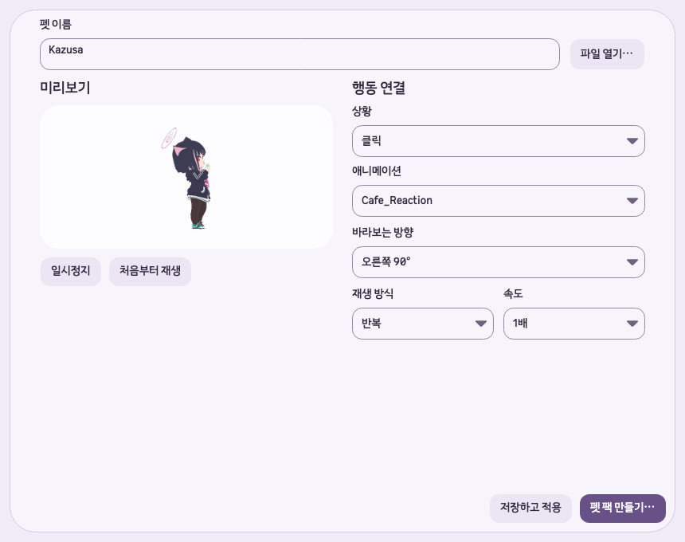

# 펫 팩 행동별 설정 개편 — 2026-10-05

## 원인

통합 편집기의 파일 형식 드롭다운·상단 파일 열기 행, GLB 전체에 적용되는 방향과 고급 설정,
들기·놓기·드래그·걷기의 강제 재생 방식이 사용자의 새 요구와 맞지 않았다.

최신 작업 기준은 `/Users/hwanghyeonseong/.codex/worktrees/6bca/Unfold`의
`codex/beta-v1.0.4`, HEAD `253699e8f0acbde7f3ae6abe40025b73e6483ce4`, 버전 `1.0.4-beta`다.
작업 전 모든 worktree의 HEAD·브랜치·변경·프로젝트 버전을 다시 확인했고 직전 미커밋 수정 위에서 작업했다.

## 변경

- 파일 형식 드롭다운을 제거했다. 파일 열기가 GLB·GIF·MP4·이미지 확장자로 편집 화면을 선택한다.
- GLB와 이미지/영상 편집기 모두 파일 열기 버튼을 펫 이름 입력 오른쪽 같은 줄에 배치했다.
- 기준 뼈대 입력과 고급 설정을 제거했다. 새 모델은 자동 기준 뼈대를 사용하며 기존 저장본의 수동 값은 호환을 위해 유지한다.
- 기본 대기는 반복을 유지하고 그 외 모든 GLB 행동에 한 번/반복 선택을 허용했다. 이미지/영상의 기존 반복·핑퐁 선택은 유지했다.
- 각 행동의 애니메이션 아래에 바라보는 방향을 배치했다. 방향은 `AnimationDefinition.Heading`에 저장하며 미리보기와 실제 펫이 같은 값을 사용한다.
- 행동별 방향이 없는 이전 팩은 기존 모델 방향을 상속한다. 값의 유한성과 -180~180도 범위를 검증한다.
- 들기를 반복하면 놓을 때까지 유지한다. 드래그 중의 한 번 재생은 마지막 자세를 유지하고, 놓기 반복은 다음 상호작용·알림으로 중단할 수 있다. 걷기의 한 번 재생은 완료 후 이동을 멈추고 기본 대기로 복귀한다.
- 지정된 테마·입력·버튼 스타일을 사용했다. 항목별 설명 문구는 추가하지 않았다.

현재 사용법은 [GLB 펫](../glb-pets.md)에 있다.

## 소유 파일

- Core: `CharacterLibrary.cs`, `CharacterAssetAudit.cs`, `GlbPetDraft.cs`.
- Desktop: `PetBuilderView.cs`, `GlbPetView.cs`, `CustomPetWindow.cs`, `PetWindow.PointerArt.cs`.
- 진단: `GlbDiagnostics.cs`, `SmokeDiagnostics.cs`.
- 검사: `GlbTests.cs`, `GlbEditorUxTests.cs`, `PetBuilderTests.cs`, `DesignSystemTests.cs`.
- 위 기능의 사용법·검증 기록과 문서 인덱스.

이전 Supabase·브랜드 작업과 이번 변경 범위 밖의 미커밋 파일은 시작 전 SHA-256과 비교해 보존을 확인했다.
직전 고급 설정 스타일 수정 기록은 삭제하지 않고 이번 요청으로 해당 UI가 제거됐음을 표시했다.

## 검증

| 검사 | 결과 |
|---|---|
| 집중 검사 | GLB·펫 팩·이미지/영상 58개 통과: [로그](2026-10-05-pet-action-editor/focused.log) |
| 추가 재생 검사 | 들기 반복·드래그 한 번·놓기 반복 중 알림·걷기 한 번 3개 통과: [로그](2026-10-05-pet-action-editor/pointer.log) |
| 최종 전체 Release 테스트 | 666개 통과, 실패·건너뜀 0: [로그](2026-10-05-pet-action-editor/full-final.log) |
| Release 솔루션 빌드 | 경고 0, 오류 0: [로그](2026-10-05-pet-action-editor/build.log) |
| macOS GLB 진단 | `success: true`, 실제 Kazusa의 클릭 행동에 90도·반복 저장 및 다시 읽기, 포인터 캔버스·재생 검증: [결과](2026-10-05-pet-action-editor/result.json) |
| macOS 앱 smoke | `success: true`, GIF 제작과 설정·펫 팩·최소 창·테마 회귀 검증: [결과](2026-10-05-pet-action-editor/smoke.json) |
| 시각 확인 | 네 테마, 1120×800·860×680·640×560 설정 화면, GLB 및 이미지/영상 이름·파일 열기 배치 확인 |

초기 전체 검사에서는 이름 필드가 단독으로 전체 폭을 차지한다는 이전 검증 1개가 실패했다.
이름·파일 열기 행 전체 폭과 버튼의 오른쪽 배치, 스크롤바와의 간격을 검사하도록 갱신한 뒤 전체 666개를 다시 통과했다.
자동 검사는 GIF·MP4 실제 가져오기/내보내기, 기존 방향 호환, 행동별 방향의 저장·재열기·렌더링 일치,
480px 편집기에서 가로 넘침과 하단 버튼 노출도 확인한다.

## 미검증·위험

Windows 실제 화면과 물리 마우스·키보드 입력은 이번 작업에서 검증하지 않았다.
macOS 진단은 새 격리 `UNFOLD_DATA_DIR`의 네이티브 렌더링과 자동 조작이다.
사용자 데이터와 현재 실행 중인 앱은 교체하지 않았다. 변경은 미커밋·미배포 상태다.

## 화면

[전체 설정 화면](2026-10-05-pet-action-editor/settings-glb-1120-800.png) ·
[최소 창 행동 설정](2026-10-05-pet-action-editor/settings-click-640-560.png) ·
[이미지/영상 편집기](2026-10-05-pet-action-editor/settings-pet-create-tab.png)
