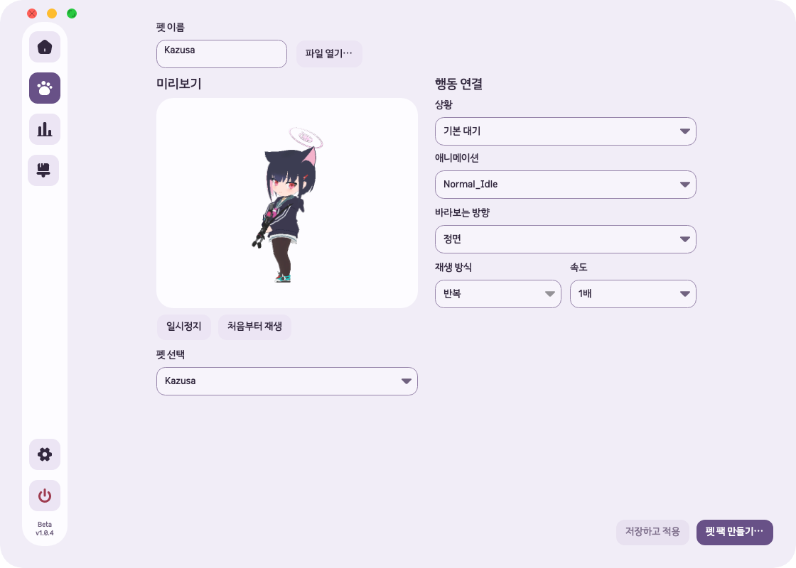

# 기존 펫 팩 재적용·펫 관리 화면 — 2026-10-05

## 원인

사용자가 제공한 `/Users/hwanghyeonseong/Downloads/kazusa.unfoldpet`은
팩 형식 1, 런타임 형식 1, 콘텐츠 버전 `1.0.0`의 유효한 GLB 팩이었다.
앱 버전 비교가 아니라 `CharacterLibrary.InspectInstallLocked`의 콘텐츠 버전 비교 때문에
설치된 팩보다 낮은 버전이 거부됐다. 같은 버전인데 파일 내용이 다른 경우도 거부하고 있었다.

기존 펫 관리는 열기·만들기 하위 탭을 사용했다. 만들기 화면의 공통 파일 선택기는
`.unfoldpet`을 받지 않았고, 설치된 GLB 선택은 별도 상단 행에 있었다.

작업 기준은 `/Users/hwanghyeonseong/.codex/worktrees/6bca/Unfold`,
`codex/beta-v1.0.4`, HEAD `253699e8f0acbde7f3ae6abe40025b73e6483ce4`, 버전 `1.0.4-beta`다.
모든 worktree의 브랜치·HEAD·미커밋 변경·프로젝트 버전을 확인하고 최신 미커밋 수정 위에 적용했다.

## 변경

- 유효한 팩의 하위·동일·상위 콘텐츠 버전을 모두 설치할 수 있게 했다. 이전 버전 또는 같은 버전의 다른 내용은 선택한 팩으로 교체한다.
- 해시·파일 크기·경로·미리보기 스냅샷·기본 펫 ID 보호·설치 직전 변경 감지와 실패 복구는 유지한다. 알 수 없는 파일 형식을 무조건 허용하지 않는다.
- 내비게이션을 **펫 관리**로 바꾸고 만들기 화면을 직접 표시한다. 열기 페이지와 상단 두 탭은 제거했다.
- 공통 **파일 열기…**가 `.unfoldpet`, GLB, GIF, MP4, 이미지를 받는다. 팩을 고르면 별도 확인 창에서 미리보고 **저장**으로 적용한다. 닫으면 설치하지 않으며 작성 중 초안은 유지한다.
- 팩 생성 후에도 확인 창을 사용한다. 적용·닫기 후 같은 펫 관리 화면으로 돌아온다.
- 펫 이름 폭을 미리보기 열의 절반으로 맞추고 파일 열기를 오른쪽에 배치했다.
- 넓은 창에서 미리보기 표면과 행동 입력 영역의 하단을 맞췄다. 작은 창은 140px 미리보기와 세로 행동 배치를 유지한다.
- **저장한 펫**을 **펫 선택**으로 바꾸고 재생 버튼 아래에 배치했다. 기본 이미지/영상 화면에서도 설치된 GLB 편집 목록으로 진입할 수 있다.
- 기존 테마·입력 스타일을 사용하고 항목별 설명 문구는 추가하지 않았다.

## 소유 파일

- Core: `CharacterPack.cs`.
- Desktop: `PetManagementView.cs`, `PetBuilderView.cs`, `PetPackWindow.cs`, `PetEditorWorkspace.cs`, `CustomPetWindow.cs`, `GlbPetView.cs`, `SettingsWindow.Layout.cs`.
- 진단: `SmokeDiagnostics.cs`, `GlbDiagnostics.cs`.
- 검사: `CharacterPackTests.cs`, `PetBuilderTests.cs`, `PetPackWindowTests.cs`, `PetTabsUiTests.cs`, `CustomPetTests.cs`, `SettingsDashboardTests.cs`, `ThemeTests.cs`, `ResponsiveLayoutTests.cs`, `UiAuditRegressionTests.cs`, `DesignSystemTests.cs`, `PurchaseGateTests.cs`.
- 사용법·디자인 시스템·검증 문서와 인덱스.

작업 전 미커밋 파일 87개의 해시를 보관했다. 위 소유 파일 외의 기존 호버·캔버스·GLB 런타임·Supabase·브랜드 변경을 그대로 보존했다.

## 검증

| 검사 | 결과 |
|---|---|
| 수정 전 재현 | 하위 버전·동일 버전 다른 내용 재적용 검사 2개 실패, 나머지 13개 통과: [로그](2026-10-05-pet-management-compatibility/before-tests.log) |
| 집중 검사 | 팩·편집·초안·레이아웃 58개 통과: [로그](2026-10-05-pet-management-compatibility/focused.log) |
| 테마·반응형 검사 | 7개 통과: [로그](2026-10-05-pet-management-compatibility/layout.log) |
| 최종 전체 Release 검사 | 672개 통과, 실패·건너뜀 0: [로그](2026-10-05-pet-management-compatibility/full-final.log) |
| 최종 Release 솔루션 빌드 | 경고 0, 오류 0: [로그](2026-10-05-pet-management-compatibility/build.log) |
| macOS 실제 Kazusa 팩 | `1.0.1` 설치 후 기존 `1.0.0`을 파일 열기·확인·저장 경로로 적용, 펫 선택 완료: [결과](2026-10-05-pet-management-compatibility/native.json) |
| macOS 통합 진단 | `success: true`, 타이머·알림·설정·GIF 제작·팩 설치 회귀 확인: [결과](2026-10-05-pet-management-compatibility/smoke.json) |
| 네이티브 UI | 1120×800, 860×680, 640×560과 네 테마 캡처. 이름 폭·파일 열기 위치·선택기 순서·가로 넘침 확인 |
| 패치 검사 | `git diff --check` 통과 |

초기 전체 검사에서는 671개 중 669개가 통과하고, 삭제된 열기 페이지의 미리보기와 설치 버튼을 찾던 검사 2개가 실패했다.
이를 현재 만들기 화면의 미리보기·생성 버튼으로 갱신했다. 팩 확인 창 자체의 설치 검사는 유지하며,
기본 화면에서 저장한 GLB로 전환하는 검사도 추가했다. 최종 높이 조정까지 반영한 전체 672개를 통과했다.

실제 Kazusa 원본의 SHA-256은 `AF0C0341BA1C9007DA4BE8590EA52FFB95A3B67BA1A5AB93F7A4A2D5D58092D9`다.
재적용 후 기존 행동 연결 10개가 JSON 비교상 동일하고 원본 파일 해시도 그대로였다.
진단은 별도 빈 `UNFOLD_DATA_DIR`에서 실행했으며 사용자 라이브러리를 교체하지 않았다.

[네이티브 측정 소스](2026-10-05-pet-management-compatibility/NativePackProbe.cs) ·
[측정 프로젝트](2026-10-05-pet-management-compatibility/NativePackProbe.csproj)

## 미검증·위험

Windows 실제 화면·입력과 macOS 물리 마우스·시스템 파일 선택 창은 검증하지 않았다.
macOS 진단은 실제 네이티브 창과 렌더링을 사용하지만 파일 경로·버튼 입력은 코드로 지정했다.
정상 팩의 콘텐츠 버전에 따른 적용 제한을 제거했으며, 손상 파일이나 지원하지 않는 새 형식까지 허용한다는 뜻은 아니다.
**펫 선택**은 기존 GLB 편집 목록이다. 이미지·영상 팩은 **파일 열기…**로 확인·적용한다.

현재 실행 중인 일반 앱은 교체하지 않았다. 변경은 미커밋·미배포 상태다.

## 화면

[최소 창](2026-10-05-pet-management-compatibility/glb-640-560.png) ·
[이미지·영상 편집](2026-10-05-pet-management-compatibility/media-builder.png) ·
[Kazusa 이전 버전 적용 확인](2026-10-05-pet-management-compatibility/kazusa-replace-preview.png)
