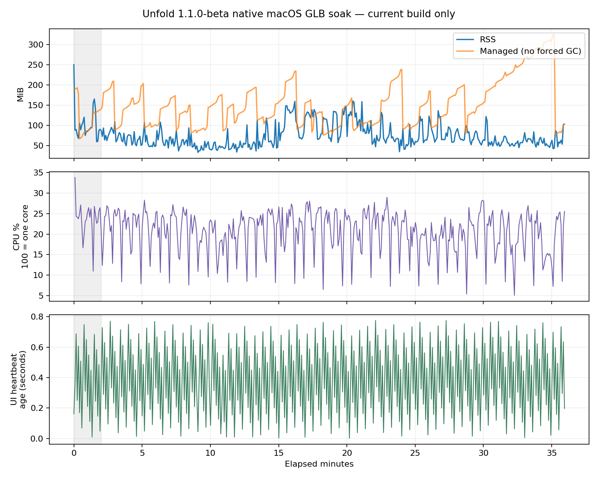

# Agency 다음 단계 — Windows 준비·GLB native 장시간 측정

2026-10-06 · 기준 `codex/glb-import-compat`, `1.1.0-beta`, `1a74cbf`.

## 결과

현재 macOS native Avalonia 런타임의 GLB/2D 전환 워크로드를
**36.00분** 실행했다. 재생 오류 0건,
제품 로그 오류 없음, 모델별 프레임/이미지 변화 확인. 실제 Windows는 환경 대기다.
이 측정은 현재 빌드의 기준 자료이며 이전 빌드 대비 개선·무회귀 또는 모든 크기/DPI에서의
성능 통과를 판정한 결과가 아니다. 같은 조건의 이전 native 런타임 측정은 후속으로 남는다.

## 실행과 환경

- 최신 표준 Release DLL과 실행 DLL의 SHA256 일치 확인. 제품 입력 141개 hash 전후 동일.
- 실제 macOS native AppRuntime/PetWindow/AnimationView, 화면 안 배치, renderScaling=1, GLB 192px.
- Hikari·Kazusa 원본을 read-only로 가져온 뒤 격리 프로필에서 설치. 원본 GLB는 저장소에 포함하지 않았다.
- 120초 워밍업, 5초 독립 스레드 샘플, 측정 중 강제 GC 없음. 작업 타이머는 정지했다.
- 행동·누름/놓기·숨김/복원·GLB/2D 전환은 내부 진단 호출. 물리 마우스 입력, 실제 로그인/결제,
  설치 업데이트, Windows GPU/DPI, 지속 FPS 측정은 수행하지 않았다.
- 정규 앱의 창·렌더러를 외부 진단 host로 실행했다. 일반 Velopack 실행 진입과 운영 구매 gate는 우회했다.

## 자원 측정

워밍업 이후 408개 표본. CPU 100%는 한 코어 사용량이다.
종료 캡처 뒤에 기록한 마지막 표본은 CPU 분자에 캡처 작업이 섞일 수 있어
자원 요약·그래프에서 제외했고, 원본에는 보존했다.
최초 CPU 표본도 정상 5초 간격이 아니므로 CPU 그래프에서 제외했다.

| 지표 | 중앙값 | p95 | 최대 |
|---|---:|---:|---:|
| RSS MiB | 64.09 | 133.00 | 160.27 |
| Managed MiB (강제 GC 없음) | 146.11 | 270.62 | 324.76 |
| CPU % (한 코어 기준) | 21.65 | 26.48 | 28.96 |

워밍업 후 첫 5분 RSS 중앙값 64.09MiB,
마지막 5분 56.81MiB.
워밍업 이후 구간의 단순 선형 기울기는 0.12MiB/분이다.
이는 모델·행동 전환과 GC가 섞인 한 실행의 기술 통계이며 누수 확정/배제 통계 검정이 아니다.
Managed 첫/마지막 5분 중앙값은 145.48/250.53MiB다.
후반 Managed 중앙값 상승과 GC 시점의 감소가 함께 관찰됐다. 같은 워크로드에서
GC 뒤 잔존량과 할당 원인을 추가로 분리해 확인해야 한다.

모델별 표본도 분리했다. CPU는 직전 샘플 구간 사용량이고 모델명은 표본 끝의 UI 상태라
전환 구간이 섞일 수 있다. 같은 프로세스의 메모리여서 이전 모델의 할당·GC 영향도 포함한다.
이 값으로 모델 단독 비용이나 우열을 판정하지 않는다. 모델·행동별 상세 통계는 분석 JSON에 있다.

| 선택 상태 | 표본 수 | RSS 중앙값 MiB | Managed 중앙값 MiB | CPU 중앙값 % |
|---|---:|---:|---:|---:|
| bori-rabbit | 41 | 72.84 | 146.07 | 14.01 |
| Hikari | 183 | 63.92 | 150.41 | 22.83 |
| Kazusa | 184 | 64.09 | 133.80 | 21.70 |

## 반복 동작과 liveness

- GLB 모델 선택/전환 52회, 2D 전환 52회.
- 누름/놓기 52회, 행동 208회, 명시적 숨김/복원 52회.
- 모델별 프레임 index와 이미지 fingerprint 변화 확인. 실제 지속 FPS는 계측하지 않았다.
  모델별 전체 관측의 집계이며, 모든 순간에 프레임 정지가 없었다는 증거는 아니다.
- 최대 UI heartbeat 간격 1.37초. 독립 스레드가 관찰한
  heartbeat age 최대 0.78초. 같은 지표가 아니므로 구분한다.
  첫 heartbeat 간격에는 타이머 시작 전 모델 선택·캡처 준비 시간이 섞일 수 있다.
- 5초 끝점 표본으로 추정한 GLB 선택 시간 32.50분,
  GLB visible 시간 31.33분.
  숨김/전환이 표본 사이에 발생하므로 정확한 프레임별 재생시간은 아니다.

## Windows 준비

접근 가능한 표준 위치에서 VM·Windows 실행 환경을 찾지 못했다.
사용자가 현재 Mac만 사용할 수 있다고 확인했으므로 Windows 실기는 환경 대기로 유지한다.
[D01 환경·W01–W12·증거 양식](2026-10-06-agency-next-stage/windows-gate.md)을 작성하고,
[기존 실기 체크리스트](../windows-dogfooding-log.md)를 현재 1분·저장·말풍선·숨긴 펫 알림 계약으로 갱신했다.
실행 체크는 모두 공란이다. 과거 preview ZIP은 현재 입력과의 일치를 증명하지 못해 최신 실행본으로 간주하지 않았다.

## 검증과 남은 조건

60초 native 파일럿 통과 후 정규 실행, 소스/자산 hash 보존, 문서 링크·diff 검사.
전체 Release 검사는 제품 입력이 바뀌지 않아 반복하지 않았다.
현재 측정에서 제품 결함을 재현하지 못했으므로 D03 코드 수정은 시작하지 않았다.
다음은 Managed 할당·GC 뒤 잔존량 분석, 동일 native 프로토콜의 이전 빌드 비교,
고DPI/다른 크기, 실제 Windows 입력·설치 업데이트,
운영 OAuth·구매·환불 검증이다.

근거: [결과](2026-10-06-agency-next-stage/result.json),
[분석](2026-10-06-agency-next-stage/analysis.json),
[입력 hash](2026-10-06-agency-next-stage/input-manifest.json),
[측정 원본](2026-10-06-agency-next-stage/samples.jsonl),
[동작 이벤트](2026-10-06-agency-next-stage/events.jsonl),
[하네스](2026-10-06-agency-next-stage/harness/README.md).
