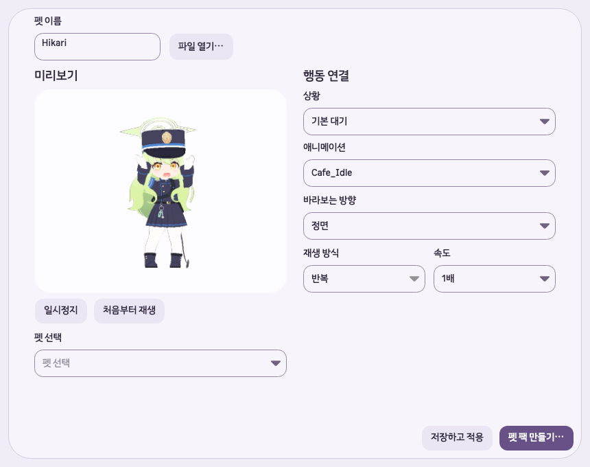

# Hikari 및 GLB 가져오기 호환성 · 2026-10-06

## 기준과 원인

- 최신 체크아웃: `/Users/hwanghyeonseong/.codex/worktrees/beta-v1-1-0/Unfold`, 기준 `671729a`, 프로젝트 `1.1.0-beta`.
- 수정 브랜치: `codex/glb-import-compat`. 배포된 앱·공개 릴리스는 교체하지 않았으며, 새 소스는 공개하지 않았다.
- 배포된 Apple Silicon 앱의 실제 `Unfold.Core.dll`로 `/Users/hwanghyeonseong/Downloads/BlueArchiveModels-main`의 295개 GLB를 읽어 실패를 재현했다.
- `Hikari.glb`는 7,868,992 bytes, 삼각형 13,344개, 애니메이션 35개다. 파일 크기·개수 제한에 걸린 것이 아니라 `CH0242_Ticket`의 `alphaMode=BLEND` 때문에 전체 파일이 거부됐다.
- 원본 SHA-256: `81fe9b072e4debdf8f0f28f10daca70a2bf74e7f2041d970fa1821ea8df48d5d`.

첫 실패 기준으로 **정상 221개, 실패 74개**였다. 실패는 BLEND 61개, 동작 이름 중복 11개, 시간 키 오류 2개였다. 재질 제한을 해소한 뒤 Ayane (Swimsuit)의 시간 키 오류가 추가로 드러났다.

## 변경과 소유 파일

- `src/Unfold.Core/GlbModel.cs`: BLEND 허용, 중복 애니메이션 이름을 안정적인 접미사로 구분, 잘못된 시간 키에 동작명 안내. 전체 화면에 그릴 메시 인스턴스도 삼각형 10만 개 예산에 포함한다.
- `src/Unfold.Core/GlbModel.Rendering.cs`: 불투명·컷아웃 깊이 처리 후 반투명 삼각형을 뒤에서 앞으로 합성한다. 불투명 형상 뒤의 반투명 면은 가려지고, 알파 0은 배경을 가리지 않는다. 동일 면의 공유 경계는 한 번만 합성하며 PixelImage의 straight-alpha 저장 방식을 유지한다. 임시 삼각형 목록은 모델별로 재사용한다.
- `Tests/Unfold.Tests/GlbCompatibilityTests.cs`: 알파 모드, 배경 투과, 그리기 순서, 깊이 가림, 공유 경계, 중복 이름의 저장·재열기, 시간 키 오류 및 인스턴스 예산 회귀 검사 12개.
- 지원 범위 문서와 이 검증 기록만 갱신했다. 사용자 GLB 원본, 계정·타이머·윈도우 코드와 배포 파일은 변경하지 않았다.

이름 중복은 glTF에서 허용한다. 첫 원래 이름을 유지하고 뒤의 중복 항목에 `(2)`, `(3)` 등을 붙이되 파일 안에 이미 존재하는 이름과 충돌하지 않는다. 같은 파일을 다시 읽을 때 동일한 이름이 생성되므로 저장된 행동 연결을 재사용할 수 있다.

## 검증

| 구분 | 결과 |
|---|---|
| 배포본 재현 | 295개 중 221개 읽기·기본 대기 미리보기 성공, 74개 실패 |
| 수정본 전수 검사 | 295개 중 292개 읽기·기본 대기 첫/중간 프레임 렌더링 성공, 3개 시간 키 오류. 71개가 추가로 열림 |
| 기존 모델 회귀 | 기존 정상 221개 각각의 첫/중간 프레임 SHA-256이 수정 전후 모두 동일 |
| Hikari 렌더링 | 35개 클립 각각 중간 시점 64px 샘플 렌더링 성공. 기본 대기 192px 미리보기의 불투명·반투명 픽셀 확인 |
| GLB 집중 검사 | 최초 수정 후 54/54 통과 |
| 최종 전체 Release 검사 | 687/687 통과, 실패·건너뜀 0. 마지막 인스턴스 예산 검사 포함 |
| macOS UI 통합 진단 | 새 `UNFOLD_DATA_DIR`, 실제 Avalonia macOS 백엔드에서 파일 열기 → 미리보기 → 저장·적용 → 재열기 성공. 480×560·860×680 편집 화면, 설정 화면, 확대 렌더링 확인 |
| Hikari 주요 행동 | idle, click, pickup, held, land, walk 각각 재생 완료 이벤트 1회; 일시정지·숨김 상태 보존 |
| 원본 보존 | 원본 GLB는 읽기만 수행. 검사 팩은 새 임시 프로필에 저장 |

UI 진단은 프로그램에서 파일 선택 결과와 버튼 이벤트를 제공했다. 실제 마우스 조작·파일 선택 대화상자·Windows 실기 검증과 구분한다. 다른 291개 모델은 기본 대기의 두 프레임을 검사했으며 모든 동작 전체를 사람 눈으로 검수한 것은 아니다.

## 남은 파일 오류

| 파일 | 동작 | 중복 시각과 위치 |
|---|---|---|
| Akari (New Year).glb | SM019601_Appearance | sampler 40의 key 44→45가 모두 1.5000001192초 |
| Mutsuki (New Year).glb | Normal_Callsign | sampler 15의 key 6→7이 모두 1.5000001192초 |
| Ayane (Swimsuit).glb | Public01 | key 61→62가 모두 2.4666669369초 |

위 위치는 0부터 시작한다. glTF의 시간 키는 엄격히 증가해야 한다. 중복 키를 자동 삭제하거나 움직임을 임의로 보간하지 않고, 내보내기 원본에서 정리한 뒤 다시 내보내도록 안내한다.

## 한계와 배포 상태

- 수정은 **로컬 개발본에만 적용**했다. 공개 Beta v1.1.0 설치 파일은 기존 동작을 유지한다. 배포하려면 별도 버전으로 빌드·서명·공증·게시해야 한다.
- 반투명 면은 삼각형 평균 깊이로 정렬한다. 서로 관통하거나 고리처럼 겹친 투명 면은 완벽한 순서 독립 투명도를 보장하지 않는다. 원본 게임의 셀 셰이더·광원·재질 표현 전체를 재현한 것은 아니다.
- Windows에서의 실제 가져오기·화면·성능은 미검증이다. 읽기와 CPU 렌더링은 공통 .NET 코드다.
- JPEG, sparse accessor, 압축 메시, 필수 확장 등 다른 명시적 미지원 형식과 기존 파일·메모리 제한은 유지한다.

[295개 파일별 결과 CSV](2026-10-06-glb-compatibility/glb-file-results.csv), [전후 비교](2026-10-06-glb-compatibility/comparison.json), [Hikari UI 진단](2026-10-06-glb-compatibility/hikari-ui.json).

형식 근거: [glTF 2.0 이름 규칙](https://registry.khronos.org/glTF/specs/2.0/glTF-2.0.html#properties-reference), [알파 재질](https://registry.khronos.org/glTF/specs/2.0/glTF-2.0.html#alpha-coverage), [애니메이션 시간 입력](https://registry.khronos.org/glTF/specs/2.0/glTF-2.0.html#animation-sampler-input).

## 수정 개발본 미리보기

아래는 macOS 백엔드 통합 진단이 저장한 앱 클라이언트 화면이다.

