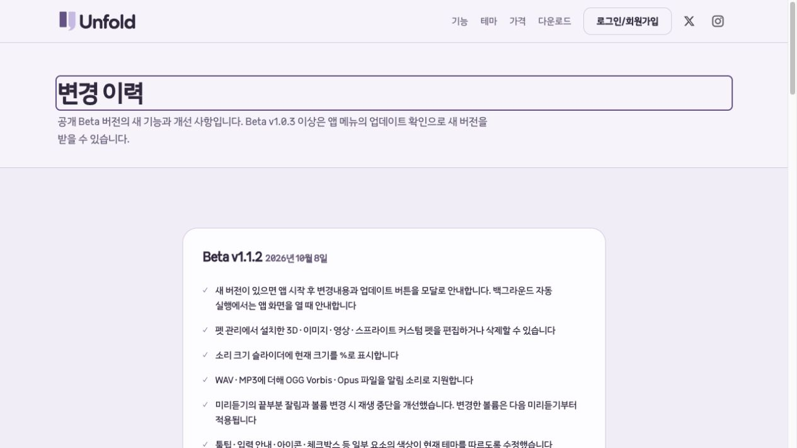

# Beta v1.1.2 배포·업데이트 검증

2026년 10월 8일. 사용자 요청의 시작 업데이트 모달 구현, 기존 1.1.2 수정사항 커밋·푸시,
서명·공증·설치 파일 게시, 웹 연결과 변경내용 갱신을 완료했다.

## 소스와 배포 기준

- 제품 소스: `codex/remove-unused-features`, `ce86c7b2de38532a926ff5ecc28bd3b2d5b43e1f`, `1.1.2-beta`.
- 작업·검증 경로: `/Users/hwanghyeonseong/Documents/GitHub/Unfold/.worktrees/remove-unused-features`.
- [공개 릴리스](https://github.com/C-Caffe1ne/Unfold/releases/tag/v1.1.2-beta)의 태그는 위 제품 커밋을 가리킨다. prerelease이며 draft는 아니다. 공개 자산은 10개다.
- Windows 실제 업데이트 QA 후속 소스: `d5c7da925c34d012d5a5146ad9d1c739a5917463`. 제품 코드는 변경하지 않고 1.1.1→1.1.2 검증 입력과 변경내역 검사를 갱신했다.
- 웹 공개 파일: `dokhustudio/unfoldpet-web`의 `main`, `f284da36c4977c1f9ea68a35bc1f012699d86d62`.
  기존 Cloudflare 자동 배포로 [다운로드](https://unfoldpet.dokhustudio.com/install)와
  [변경 이력](https://unfoldpet.dokhustudio.com/changelog)에 반영했다.
- 이후 문서·검증 기록 커밋은 배포 소스와 구분한다. 공개 설치 파일·태그를 교체하지 않는다.
  이전 작업트리와 웹의 별도 로컬 계정·판매 작업 두 커밋은 보존했다.

## 포함된 변경

[릴리스 노트](../releases/v1.1.2-beta.md)의 7개 항목을 웹과 업데이트 패키지에 포함했다.
시작 시 새 버전 모달, 설치한 커스텀 펫 편집·삭제, 소리 %, OGG,
미리듣기 잘림 개선, 테마 색상, 폐기된 편집 파일 정리다.
기본 제공 펫은 편집·삭제 대상에서 제외한다.

시작 모달은 계정 복원 뒤, 표시된 계정/설정 창을 소유자로 삼는다. 백그라운드 실행과
이미 열린 대화상자에서는 유예하고, 한 실행에서 중복 표시하지 않는다.
최신 버전·조회 오류에는 열지 않는다. 다운로드·재시작은 사용자가 선택한다.
변경내역은 최대 12,000자, 줄바꿈과 세로 스크롤을 제공하며 웹 변경 이력도 연결한다.
관련 49개 검사, 전체 793개 검사, 네 테마의 실제 macOS 모달 캡처는
[시작 안내 기록](2026-10-08-startup-updates.md)에 있다.

## 빌드·서명·설치 검사

| 검사 | 결과와 실행 환경 |
|---|---|
| 로컬 Release | 793/793 통과 |
| 같은 제품 소스의 Mac CI | 793/793 통과 |
| 같은 제품 소스의 Windows CI | 790 통과, Mac 전용 3개 건너뜀, 실패 0 |
| Mac Apple Silicon 앱·DMG | Developer ID 서명, Apple 공증 Accepted, ticket stapling 검증, Gatekeeper 통과 |
| Mac Intel 앱·DMG | Developer ID 서명, Apple 공증 Accepted, ticket stapling 검증, Gatekeeper 통과 |
| Mac ARM64 게시 앱 | 새 데이터 폴더의 native 진단 성공, 100장 캡처, Beta v1.1.2 표시 |
| Mac x64 게시 앱 | Apple Silicon의 Rosetta에서 native 진단 성공, 100장 캡처 |
| Windows x64 설치 파일 | Windows CI 설치·재설치·제거와 데이터 보존, native 진단 성공, 100장 캡처 |

[제품 CI](https://github.com/C-Caffe1ne/Unfold/actions/runs/37773706875)는 정확히 `ce86c7b`에서 성공했다.
Mac 서명자는 `Developer ID Application: DongJin Lee (R4TV856AS9)`다.
이번 버전 전송의 사용자 승인 후 기존 Keychain 인증으로 앱·DMG 네 건을 공증했다.
제출 ID·결과는 [공증 증거](evidence/2026-10-08-beta-v1.1.2/apple-notarization.json)에 기록한다.

| 공개 설치 ZIP | 크기 | 바이트 수 |
|---|---:|---:|
| Apple Silicon notarized installer | 73.8 MiB | 77,425,330 |
| Intel notarized installer | 77.8 MiB | 81,631,423 |
| Windows x64 installer | 82.7 MiB | 86,689,249 |

ZIP 3개·ZIP 체크섬·업데이트 full 패키지 3개·채널 JSON 3개, 총 10개 자산의 크기와
GitHub SHA-256 digest가 로컬 게시 원본과 일치했다.
[자산 확인](evidence/2026-10-08-beta-v1.1.2/github-asset-verification.json),
[공개 파일 원장](evidence/2026-10-08-beta-v1.1.2/public-manifest.json),
[공개 릴리스](evidence/2026-10-08-beta-v1.1.2/public-release.json)에 해시와 URL을 보관한다.
Windows 설치 파일은 아직 코드 서명되지 않았다.

## 공개 업데이트 검사

Velopack 실제 SDK로 `osx-arm64`, `osx-x64`, `win-x64` 공개 채널을 검사했다.
각 채널에서 이전 버전 1.1.1은 1.1.2를 발견하고 다운로드 후 `Ready`가 됐다.
패키지 크기·SHA-256은 원장과 일치했고, 새 세션에서도 대기 상태와 패키지 안의
변경내역을 복원했다. 피드의 변경내역과 현재 1.1.2의 `Current` 판정도 통과했다.
[공개 SDK 증거](evidence/2026-10-08-beta-v1.1.2/public-update-probe.json)의 `applyExecuted: false`는
채널 검사 자체의 범위다. 실제 교체·재시작은 아래 별도 검사에서 수행했다.

| 실제 적용 | 결과 |
|---|---|
| Mac ARM64 | 공증된 1.1.1 테스트 사본에서 실제 `AppUpdates.PrepareApply`·`UpdateMac`으로 1.1.2 교체, 자동 진단 재시작, 100장 성공, 격리 데이터 표식 해시 보존 |
| Windows x64 CI | 공개 1.1.1 설치 뒤 실제 `AppUpdates.PrepareApply`·`Update.exe`로 1.1.2 교체, 자동 진단 재시작, 100장 성공, 격리 데이터 표식 보존 |

Mac 검사는 실제 사용자 설치본·프로필 대신 별도 사본과 `UNFOLD_DATA_DIR`을 사용했다.
Windows 검사는 새 GitHub runner에서만 실행되며 사용자 Windows 설치본은 변경하지 않는다.
[Windows 실제 업데이트 CI](https://github.com/C-Caffe1ne/Unfold/actions/runs/37777538306)가 성공했다.
GitHub에 남아 있는 이전 워크플로 표시명과 구분하여, 실행 소스·결과 JSON의
`fromVersion: 1.1.1-beta`, `version: 1.1.2-beta`를 확인했다.

- [Mac 실제 적용](evidence/2026-10-08-beta-v1.1.2/macos-actual-update.json), [재시작 진단](evidence/2026-10-08-beta-v1.1.2/macos-after-update-smoke.json)
- [Windows 실제 적용](evidence/2026-10-08-beta-v1.1.2/windows-actual-update.json), [적용 직전 패키지](evidence/2026-10-08-beta-v1.1.2/windows-before-apply.json), [재시작 진단](evidence/2026-10-08-beta-v1.1.2/windows-after-update-smoke.json)

## 웹 반영

웹 자동 검사 71개·HTML/내부 참조 검사·Wrangler dry run·차이의 공백 검사를 통과했다.
배포 후 공개 검사 50개가 성공했다: HTML 주소 4개, 다운로드 리다이렉트 39개,
설치 ZIP 3개와 체크섬의 전체 다운로드·해시, 내부 경로 3개의 404다.
이전 다운로드 주소 35개와 1.1.1의 사용자가 선택한 변경내용 6개를 보존했고,
1.1.2 주소 4개와 새 변경내용 7개를 추가했다.
[공개 검사 결과](evidence/2026-10-08-beta-v1.1.2/public-web.json)에 각 응답과 해시를 기록한다.

인앱 브라우저에서 실제 공개 변경 이력의 버전·날짜·7개 항목과 이전 1.1.1 기록을 확인했다.

## 검증 경계

Mac x64는 Rosetta 실행이며 물리 Intel 검사와 구분한다. Windows는 native CI 결과이며
물리 사용자 포인터 입력·기기별 DPI·스크린리더·실제 소리 청취를 증명하지 않는다.
시작 모달의 네 테마 Mac 창은 합성 새 버전 응답을 사용했다. 공개 서버의 발견·다운로드와
실제 적용은 별도 위 검사로 확인했다. 로그인 복원 지연·배경 실행·중복 방지는 자동 검사다.
운영 OAuth·실제 구매/환불과 임의 펫·장시간 사용의 400 MB 상한은 이번 배포 검사 범위 밖이다.
실행 중인 기존 개발 앱과 실제 사용자 데이터는 변경하지 않았다.
