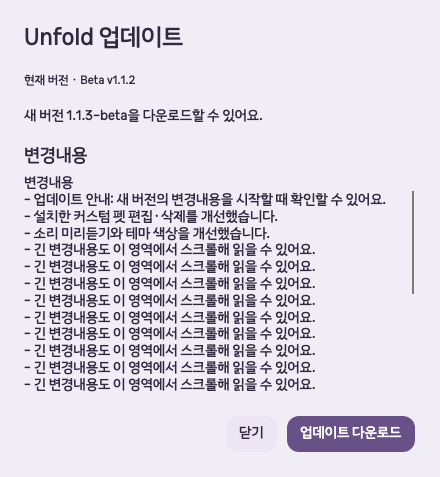

# Beta v1.1.2 시작 업데이트 안내 검증

2026년 10월 8일 · `codex/remove-unused-features` · `1.1.2-beta`

## 변경과 동작

- 시작 시 기존 업데이트 조회 결과가 새 버전 또는 재시작 대기 상태이면, 계정 복원과 화면 준비가 끝난 뒤 소유 창이 있는 모달로 한 번 안내한다.
- 백그라운드 자동 실행은 화면을 열 때까지 안내를 미룬다. 최신 버전·조회 오류·업데이트를 지원하지 않는 설치·진단 실행에는 자동 안내를 띄우지 않는다.
- 닫은 안내를 같은 실행에서 자동으로 다시 열지 않는다. 메뉴·설정의 업데이트 확인은 계속 사용할 수 있다. 기존 업데이트 창을 중복 생성하지 않는다.
- Velopack 공개 피드와 다운로드된 패키지에서 변경내역을 전달한다. 최대 12,000자의 일반 텍스트와 높이 220의 스크롤 영역으로 표시하며, 변경내역이 없으면 웹 변경 이력을 안내한다.
- 다운로드·적용은 사용자가 직접 선택한다. 기존 휴식·미저장 펫 작업의 재시작 차단은 유지한다.

## 검증

- 수정 전 새 회귀 검사에서 시작 안내가 없다는 실패를 확인했다.
- Release 전체 회귀 검사 **793/793 통과**, 빌드 오류·경고 없음.
- 업데이트·계정 복원 관련 **49개 검사 통과**: 지연 계정 복원, 지연 업데이트 조회, 백그라운드 안내 유예, 모달·소유 창, 중복 방지, 최신/오류, 재시작 대기, 변경내역의 길이·줄바꿈·스크롤·대체 안내, 실제 SDK 변경내역 전달과 재시작 대기 복원.
- macOS 실제 Avalonia 창에서 네 테마의 모달 표시·소유 창·긴 변경내역·가로 넘침 없음, 닫은 후 중복 없음, 자동 다운로드·재시작 없음 확인. 모달 크기 440×477, 변경내역 영역 392×220.
- 격리된 새 `UNFOLD_DATA_DIR`와 합성 새 버전 피드를 사용했다. 실제 키보드·마우스 입력 검사는 아니다. 공개 배포와 실제 업데이트 적용은 별도 릴리스 검증 기록에 남긴다.

[네 테마 native 결과](images/2026-10-08-startup-updates/native-result.json)
